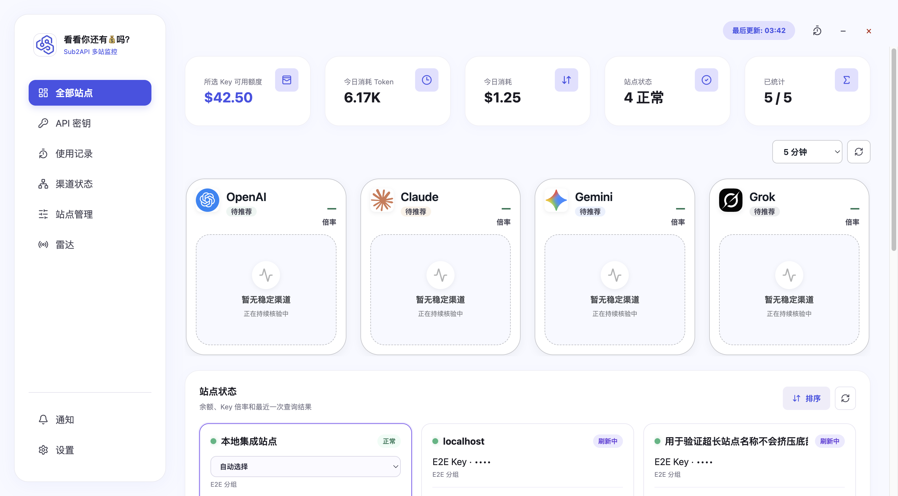

# 看看你还有💰吗？

一款面向 sub2api 多站用户的本地桌面监控工具。它将分散在多个中转站的余额、API Key 倍率、今日用量、使用记录和渠道状态集中到一个 Electron 应用中，适合需要长期管理 6–20 个 sub2api 二开站点的个人开发者。

> 项目完全在本地运行，不提供云端同步或遥测。在线更新规划仅通过 Gitee 获取稳定版安装包，不上传站点凭据和 Token；当前功能尚未实现。

## 功能概览

### 全部站点

- 按每站实际当前 API Key 汇总可用额度、今日 Token、今日消费和状态覆盖；有限额 Key 取账号余额与 Key 剩余额度的较小值，无限额 Key 使用账号余额，顶部把各站确认金额相加；当前 Key 未确定时不回退整站统计。
- 刷新按钮按当前站点优先、受控并发刷新全部站点，各卡片独立反馈进度和结果。
- 显示真实加载、刷新、部分成功、过期、认证失效和错误状态。
- Token 自动使用 K/M 紧凑格式，缺少可信倍率时明确显示不可用。
- 支持每站点独立的自动/手动默认 Key；手动模式按 Key quota 显示额度并跨切站、重启保持，只保留脱敏摘要。
- 支持每站点独立设置充值比例，并按 `原始倍率 / 充值比例` 查看各平台最低分组；未设置比例的站点不参与跨站最低价比较。
- 每张卡片可打开倍率 Popover 搜索和筛选全部分组；站点状态上方按 OpenAI、Claude、Gemini、Grok 等动态平台比较跨站最低折算倍率并保留平局。

### API 密钥

- 分页读取当前用户的全部 Key，显示完整 Key 并支持点击复制，按名称、Key、分组和状态筛选。
- 展示分组、平台、有效倍率、并发、今日与近 30 天实际消费、状态和创建时间；消费合并为一列，过期时间不再单独展示。
- 分组下拉项直接显示分组名称、平台和倍率；平台使用 Claude、OpenAI、Grok、Gemini 图标，倍率使用图标化数值。
- 普通用户可对单个 Key 切换可用分组；写入后必须远程回读一致才显示成功。
- 完整 Key 只在当前运行内存中短暂存在，不写入 SQLite、日志、缓存、CSV、截图或测试夹具；复制通过主进程 IPC 写入系统剪贴板。

### 使用记录

- 按站点、模型、分组、Key、时间、请求类型、计费类型和计费模式筛选真实用量，筛选变化约 300ms 后自动请求。
- 顶部总请求、总 Token、实际消费和平均耗时与列表使用同一筛选条件，并读取服务端统计接口。
- Key、分组和模型独立分阶段加载，慢接口不会阻塞已经返回的下拉选项。
- 每页最多 20 条，时间按本地时区显示为 `YYYY/MM/DD HH:mm:ss`。
- Token 单元格组合显示输入、输出和缓存读取 Token；首字按低于 10 秒、10–20 秒、20 秒以上分级。
- 展示思考等级 `reasoning_effort`，兼容 OpenAI 和 Claude 常见枚举。
- 支持列设置、分页和 CSV 导出；CSV 保留原始数值、排除敏感字段并防止公式注入。

### 渠道状态

- 支持站点与渠道下拉选择，切换时不使用旧对象数据冒充新结果。
- 展示渠道状态、延迟、Ping、可用率和时间线；上游未返回的指标保持“待查询”。
- 主窗口页面可见时默认每 60 秒低频刷新，可选 30/60/120 秒；隐藏、最小化或后台时暂停，并对 429 退避。
- Key 与渠道优先按结构化分组 ID 关系关联；总览遇到多个结构候选时只在候选集合内选取名称、平台和模型最接近者；渠道健康区不再显示倍率折算徽标或文案。
- 渠道超过 6 个时列表独立滚动，不影响页头和详情区。

### 站点管理与设置

- 单站录入依次验证地址、登录、资料、Key、分组、用量和渠道能力。
- 批量录入显示 `当前数/总数`，单项失败不中断剩余项，结束后统一汇总成功和脱敏失败原因。
- 通知设置包括余额阈值、站点/渠道异常、恢复通知和冷却时间。
- 通用设置包括刷新频率、数据过期阈值、悬浮窗开关/位置和开机启动。

### 独立悬浮窗

- 固定 `380 × 260` 逻辑尺寸，支持四角停靠与自由拖动，自定义坐标会持久化并在越界时安全恢复。
- 快速切换当前站点，展示余额、今日 Token/消费、倍率、实时状态和更新时间。
- 顶部优先显示站点备注；右下角提供紧邻的返回主页面和刷新当前站点按钮。
- 主窗最小化时转入悬浮窗；点击返回主页面按钮恢复并聚焦主窗。
- 不使用 `alwaysOnTop`：切换浏览器或其他应用后悬浮窗仍保持已显示，常驻显示使用非激活窗口路径，但前台应用可以覆盖它；macOS 台前调度/多 Space 下保持可见，不进入全屏应用上层。

## 界面预览

### 全部站点



### 使用记录


### 渠道状态


### 站点管理与设置


### 悬浮窗


## 视觉与窗口

- 只提供固定浅色模式，不提供深色、跟随系统或主题切换。
- 液态玻璃仅用于窗口外壳、侧边导航、工具栏、悬浮窗和浮层；表格、表单和密集数据使用高不透明表面。
- 支持减少透明效果和高对比度降级。
- `1440 × 1024` 是 Stitch 视觉参考，不是运行时固定画布。Renderer 响应式铺满 `BrowserWindow`。
- 主窗默认使用主显示器工作区宽度的 `60%`、高度的 `90%`，居中、可调整尺寸，左侧导航固定。

## 兼容的 sub2api 能力

项目以 [Wei-Shaw/sub2api](https://github.com/Wei-Shaw/sub2api) 接口结构为基线，并对常见二开包装层进行保守适配。当前覆盖：

- `POST /api/v1/auth/login`
- `GET /api/v1/profile`
- `GET /api/v1/keys`
- `GET /api/v1/keys/:id`
- `PUT /api/v1/keys/:id`
- `GET /api/v1/groups/available`
- `GET /api/v1/groups/rates`
- `POST /api/v1/usage/dashboard/api-keys-usage`
- `GET /api/v1/user/api-keys/:id/usage/daily`
- `GET /api/v1/usage`
- `GET /api/v1/usage/stats`
- `GET /api/v1/usage/dashboard/models`
- `GET /api/v1/channel-monitors`
- `GET /api/v1/channel-monitors/:id/status`

能力缺失、404 或二开字段不完整时，应用使用 `unsupported`、`待查询` 或局部错误状态，不会伪造渠道延迟、可用率或倍率。

## 安全与隐私

- Electron Renderer 使用 `contextIsolation: true`、`sandbox: true`、`nodeIntegration: false`。
- preload 仅暴露按功能分组的白名单 API，业务输入在 IPC 边界再次校验。
- 密码、access token 和 refresh token 通过 Electron `safeStorage` 使用平台安全后端保护。
- SQLite 只保存站点元数据、凭据引用、脱敏快照和设置，不存储明文密码或完整 API Key。
- 真实站点验证仅对用户明确授权的 Key 执行可恢复分组切换，并在同次验证中回读恢复原分组；不创建、删除或修改其他远程数据。
- 项目不提供云同步、遥测、付款或远程删除。在线更新已实现 `UPD-28` 核心链路：只使用 Gitee 稳定版，启动/设置/版本徽标可检查，Windows 目标为 NSIS 自动更新，macOS 在当前免费 ad-hoc 条件下采用 DMG 下载/打开降级流程。1.4.6 为真机更新测试专用；Gitee Release 已发布并完成 macOS 在线下载/替换验收，Windows 真机仍未验证。
- 发布规则：每个 Gitee Release 同时上传 macOS ARM64 的 `mac-arm64.dmg` 和 Windows x64 的 `win-x64.exe`，并同步上传两个 blockmap 与 `update-manifest.json`；Release 说明必须明确解释两个安装包的平台。

## 技术栈

- Electron 43
- React 19 + TypeScript 5.9
- Vite 8
- TanStack Query 5
- Zod 4
- Node SQLite
- Vitest 4
- Playwright Electron 1.61
- electron-builder 26

## 开发环境

已验证的本地工具链为 Node.js 24 和 npm 11。项目使用 npm，`package-lock.json` 是唯一依赖锁定事实来源，不应在同一工作区混用 pnpm。

```bash
git clone https://gitee.com/zarq/Sub2API-Multi-Hub-Monitoring-Tool.git
cd Sub2API-Multi-Hub-Monitoring-Tool
npm ci
npm run dev
```

`npm run dev` 会同时启动 Vite Renderer 与 Electron 主进程。

## 常用命令

| 命令                                            | 用途                                                          |
| ----------------------------------------------- | ------------------------------------------------------------- |
| `npm run dev`                                   | 启动 Electron 开发环境                                        |
| `npm run format:check`                          | 检查 Prettier 格式                                            |
| `npm run lint`                                  | 运行 ESLint                                                   |
| `npm run typecheck`                             | 检查 Renderer 和 Electron TypeScript                          |
| `npm run test`                                  | 运行 Vitest                                                   |
| `npm run test:e2e`                              | 运行 Playwright Electron E2E                                  |
| `npm run build`                                 | 构建 Renderer 和 Electron                                     |
| `npm run pack`                                  | 生成未打包应用目录                                            |
| `npm run dist:mac`                              | 构建 macOS ARM64 DMG                                          |
| `npm run dist:win`                              | 构建 Windows x64 NSIS                                         |
| `npm run release:publish -- --notes "修复说明"` | 构建并发布当前版本的 macOS ARM64 + Windows x64 双平台 Release |
| `npm run verify:real`                           | 使用运行时环境变量执行授权站点只读验证                        |
| `npm run verify:real-service`                   | 执行服务层只读集成验证                                        |

`verify:real*` 需要运行时凭据，请勿将凭据写入 shell 历史、`.env`、源码或测试文件。

## 当前版本 1.4.6

- `1.4.0` 新增 API 密钥管理与单 Key 分组切换，并完成使用记录自动筛选、全部站点当前 Key 统计、渠道低频实时监控、结构化渠道关联和渠道折算 UI 清理。
- `1.4.1` 修复 macOS 应用 bundle 签名不完整导致安装后可能无法打开的问题，改由 electron-builder 完成整包 ad-hoc 签名。
- `1.4.2` 统一全部站点额度口径，删除“按订阅规则”，顶部按站点当前 Key 可用金额求和，并为总览的多个结构化渠道候选增加确定性最接近择优。
- `1.4.6` 为真机更新测试专用版本，接入 Gitee 稳定版更新检查、下载校验、跳过/稍后提醒和平台安装策略；本版本不包含业务功能变化。
- 完整变更记录见 [CHANGELOG.md](CHANGELOG.md)。

## 构建与安装包

本轮 1.4.3 双平台构建产物及校验值：

| 平台                 | 文件                                                     | SHA-256                                                            |
| -------------------- | -------------------------------------------------------- | ------------------------------------------------------------------ |
| macOS ARM64          | `Sub2API-Multi-Hub-Monitor-1.4.3-mac-arm64.dmg`          | `79c3e6e9c295d6bda0b64803771e9d0dce6d84597304219f5ad4301a835ed934` |
| macOS ARM64 blockmap | `Sub2API-Multi-Hub-Monitor-1.4.3-mac-arm64.dmg.blockmap` | `e1daf4e3005f080251d404eccd814ade60690a00b06a8240cef06e7a10f3b0f0` |
| Windows x64 NSIS     | `Sub2API-Multi-Hub-Monitor-1.4.3-win-x64.exe`            | `f527a660b102ff580db529f17710c452c0806a3b563be94c83bdfccefec55b7c` |
| Windows x64 blockmap | `Sub2API-Multi-Hub-Monitor-1.4.3-win-x64.exe.blockmap`   | `6e707a5e4f3d7ce99e31653ed2a219e1514b1832159104433871940f04b3fcd2` |

安装包体积较大，不纳入 Git 源码历史，应通过 Gitee Release 或其他独立分发渠道发布。

### 一键发布在线更新

以后发布新版本只需：

```bash
npm run release:publish -- --notes "本次更新说明"
```

命令会读取 `package.json` 版本，检查 `CHANGELOG.md`，要求工作区干净，创建并推送同名 Git 标签，构建并校验 macOS ARM64 DMG、Windows x64 NSIS、两个 blockmap 和 `update-manifest.json`，再创建 Gitee Release 并上传全部五个文件。`mac-arm64.dmg` 是 macOS ARM64 安装包，`win-x64.exe` 是 Windows x64 安装包；发布令牌只从 macOS Keychain 的 `sub2api-gitee-release-token` 读取。

真机更新测试专用版本使用：

```bash
npm run release:publish -- --notes "真机更新测试专用" --test-only
```

该参数会把“真机更新测试专用、无业务功能变化”写入 Release 说明。发布前可用 `--dry-run` 只检查参数、版本和 CHANGELOG，不执行构建、标签或上传。

发布规则：每次功能优化或修复都必须递增版本号并重新生成 macOS ARM64 DMG、Windows x64 NSIS；`release/` 只保留最新版本产物，旧安装包应在生成新版本前清理。历史版本恢复必须基于对应远端提交的完整代码树，不能只回写版本号。

### macOS

- 当前产物为 ARM64，适用于 Apple Silicon Mac。
- DMG 已通过 `hdiutil verify`。
- 当前使用完整 ad-hoc 签名，bundle 严格签名校验通过；仍不是 Apple Developer ID 签名且未公证，首次打开时可能需要使用 macOS 提供的“打开”确认流程，不建议关闭系统安全机制。

### Windows

- 已交叉构建 x64 NSIS 安装器，并检查为 NSIS PE32；解包主程序为 PE32+ x86-64。
- 尚未在 Windows 真机上安装和启动，不应将交叉构建结果表述为 Windows 真机通过。

## 验证状态

2026-07-24 `1.4.3` 当前证据：

- Prettier、ESLint、TypeScript：通过。
- Vitest：34 个文件，215 项通过。
- 开发 Electron E2E：目标流程 1 项通过；完整安装态 E2E 需在下一轮单实例清理后复跑。
- 两个授权站点完成 Key 分组切换、回读和原分组恢复；第三站凭据登录受 Turnstile 阻断，仅通过用户已有登录会话只读确认 API 密钥页面能力。
- macOS ARM64 安装应用：顶部 `$42.50` 跨站额度求和、有限额卡片、唯一渠道择优、宽窄总览及既有页面检查通过；16 张证据位于 `real-test-evidence/macos-1.4.2/`。
- macOS ARM64 安装副本：DMG 和 `/Applications` 应用严格签名校验通过，使用原有用户数据经 LaunchServices 正常显示前台窗口，API 密钥页面和悬浮窗页面检查通过；完整安装态 E2E 需在下一轮单实例清理后复跑。
- Windows x64：NSIS 交叉构建及 PE32+/asar/版本结构验证通过；未执行 Windows 真机。

详细步骤和证据见 [macOS 真机实测清单](liran_docs/09-%E7%9C%9F%E6%9C%BA%E5%AE%9E%E6%B5%8B.md)。

## 项目结构

```text
electron/                 Electron 主进程、preload、适配器、服务、存储与安全逻辑
src/renderer/             React Renderer、六个主导航业务界面和独立悬浮窗
tests/e2e/                Playwright Electron 端到端测试
scripts/                  真机清单校验和授权站点只读验证脚本
build/                    桌面应用图标与构建资源
liran_docs/               需求、架构、数据字典、API、任务、测试和 UI 壳文档
docs/pitfalls/            长期避坑知识库
real-test-evidence/       脱敏的 macOS 页面与验收证据
```

## 完整文档

- [项目说明书](liran_docs/00-%E9%A1%B9%E7%9B%AE%E8%AF%B4%E6%98%8E%E4%B9%A6.md)
- [需求文档](liran_docs/01-%E9%9C%80%E6%B1%82%E6%96%87%E6%A1%A3.md)
- [架构文档](liran_docs/02-%E6%9E%B6%E6%9E%84%E6%96%87%E6%A1%A3.md)
- [文档中心索引](liran_docs/03-%E7%B4%A2%E5%BC%95.md)
- [开发追踪与微观任务](liran_docs/04-%E5%BC%80%E5%8F%91%E8%BF%BD%E8%B8%AA.md)
- [API 文档](liran_docs/07-API%E6%96%87%E6%A1%A3.md)
- [测试用例](liran_docs/08-%E6%B5%8B%E8%AF%95%E7%94%A8%E4%BE%8B.md)
- [macOS 真机实测](liran_docs/09-%E7%9C%9F%E6%9C%BA%E5%AE%9E%E6%B5%8B.md)
- [UI 壳接入总清单](liran_docs/10-UI%E5%A3%B3%E6%8E%A5%E5%85%A5%E6%B8%85%E5%8D%95.md)
- [长期避坑知识库](docs/pitfalls/README.md)

## 当前限制

- 只支持固定浅色模式。
- macOS 仅构建 ARM64 产物，尚未提供 Intel x64 或 Universal 版本。
- macOS 产物为完整 ad-hoc 签名，但不是 Apple Developer ID 签名且未公证。
- Windows 安装器已交叉构建，但未完成 Windows 真机验收。
- 物理多显示器拔插未在当前单显示器 Mac 上实测。
- 渠道延迟、Ping、可用率和时间线依赖站点实际开放的监控能力。
- 开机启动在未签名、未安装的 macOS 内部包中不作为通过项。

## 贡献与开发约定

开始开发、修复、测试、部署或排障前，请先阅读 [AGENTS.md](AGENTS.md) 与 [避坑知识库](docs/pitfalls/README.md)。新确认的坑需要在任务收尾前回写。

项目当前未附加开源许可证。在许可证明确前，请勿假定代码可以被任意复制、修改或再分发。
