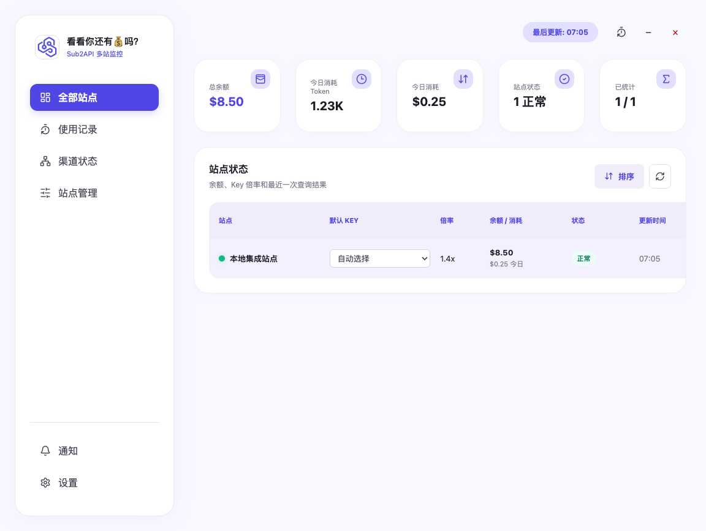
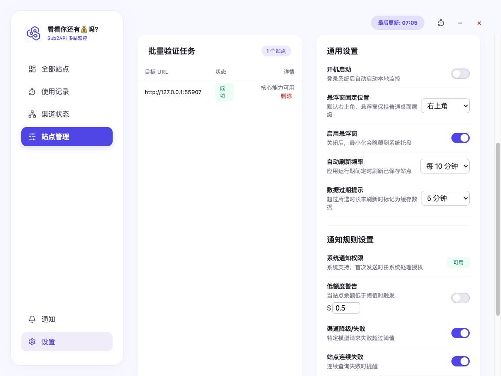

# 看看你还有💰吗？

一款面向 sub2api 多站用户的本地桌面监控工具。它将分散在多个中转站的余额、API Key 倍率、今日用量、使用记录和渠道状态集中到一个 Electron 应用中，适合需要长期管理 6–20 个 sub2api 二开站点的个人开发者。

> 项目完全在本地运行，不提供云端同步、遥测或自动更新。站点凭据和 Token 不应进入源码、日志、截图或 Git 历史。

## 功能概览

### 全部站点

- 汇总全部有效站点的余额、今日 Token、今日消费和状态覆盖。
- 显示真实加载、刷新、部分成功、过期、认证失效和错误状态。
- Token 自动使用 K/M 紧凑格式，缺少可信倍率时明确显示不可用。
- 支持自动/手动默认 Key，只保留脱敏名称，不向 Renderer 暴露完整 Key。

### 使用记录

- 按站点、模型、分组、Key、时间和请求类型筛选真实用量。
- 每页最多 20 条，时间按本地时区显示到秒。
- 展示思考等级 `reasoning_effort`，兼容 OpenAI 和 Claude 常见枚举。
- 支持列设置、分页和 CSV 导出；CSV 保留原始数值、排除敏感字段并防止公式注入。

### 渠道状态

- 支持站点与渠道下拉选择，切换时不使用旧对象数据冒充新结果。
- 展示渠道状态、延迟、Ping、可用率和时间线；上游未返回的指标保持“待查询”。
- 渠道超过 6 个时列表独立滚动，不影响页头和详情区。

### 站点管理与设置

- 单站录入依次验证地址、登录、资料、Key、分组、用量和渠道能力。
- 批量录入显示 `当前数/总数`，单项失败不中断剩余项，结束后统一汇总成功和脱敏失败原因。
- 通知设置包括余额阈值、站点/渠道异常、恢复通知和冷却时间。
- 通用设置包括刷新频率、数据过期阈值、悬浮窗开关/位置和开机启动。

### 独立悬浮窗

- 固定 `380 × 260` 逻辑尺寸，支持左上、右上、左下、右下四角停靠，默认右上并持久化。
- 快速切换当前站点，展示余额、今日 Token/消费、倍率、实时状态和更新时间。
- 主窗最小化时转入悬浮窗；点击扩大按钮恢复并聚焦主窗。
- 不使用 `alwaysOnTop`，保持普通桌面窗口层级。

## 界面预览

### 全部站点



### 使用记录


### 渠道状态


### 站点管理与设置



### 悬浮窗


## 视觉与窗口

- 只提供固定浅色模式，不提供深色、跟随系统或主题切换。
- 液态玻璃仅用于窗口外壳、侧边导航、工具栏、悬浮窗和浮层；表格、表单和密集数据使用高不透明表面。
- 支持减少透明效果和高对比度降级。
- `1440 × 1024` 是 Stitch 视觉参考，不是运行时固定画布。Renderer 响应式铺满 `BrowserWindow`。
- 主窗默认使用主显示器工作区宽度的 `60%`、高度的 `90%`，居中、可调整尺寸，左侧导航固定。

## 兼容的 sub2api 能力

项目以 [Wei-Shaw/sub2api](https://github.com/Wei-Shaw/sub2api) 接口结构为基线，并对常见二开包装层进行保守适配。当前覆盖：

- `POST /api/v1/auth/login`
- `GET /api/v1/profile`
- `GET /api/v1/keys`
- `GET /api/v1/groups/available`
- `GET /api/v1/groups/rates`
- `GET /api/v1/usage`
- `GET /api/v1/usage/stats`
- `GET /api/v1/usage/dashboard/models`
- `GET /api/v1/channel-monitors`
- `GET /api/v1/channel-monitors/:id/status`

能力缺失、404 或二开字段不完整时，应用使用 `unsupported`、`待查询` 或局部错误状态，不会伪造渠道延迟、可用率或倍率。

## 安全与隐私

- Electron Renderer 使用 `contextIsolation: true`、`sandbox: true`、`nodeIntegration: false`。
- preload 仅暴露按功能分组的白名单 API，业务输入在 IPC 边界再次校验。
- 密码、access token 和 refresh token 通过 Electron `safeStorage` 使用平台安全后端保护。
- SQLite 只保存站点元数据、凭据引用、脱敏快照和设置，不存储明文密码或完整 API Key。
- 真实站点验证仅执行只读请求，不创建、修改或删除远程 Key、渠道和用户数据。
- 项目不提供云同步、遥测、付款、远程删除或自动更新。

## 技术栈

- Electron 43
- React 19 + TypeScript 5.9
- Vite 8
- TanStack Query 5
- Zod 4
- Node SQLite
- Vitest 4
- Playwright Electron 1.61
- electron-builder 26

## 开发环境

已验证的本地工具链为 Node.js 24 和 npm 11。项目使用 npm，`package-lock.json` 是唯一依赖锁定事实来源，不应在同一工作区混用 pnpm。

```bash
git clone https://gitee.com/zarq/Sub2API-Multi-Hub-Monitoring-Tool.git
cd Sub2API-Multi-Hub-Monitoring-Tool
npm ci
npm run dev
```

`npm run dev` 会同时启动 Vite Renderer 与 Electron 主进程。

## 常用命令

| 命令                          | 用途                                   |
| ----------------------------- | -------------------------------------- |
| `npm run dev`                 | 启动 Electron 开发环境                 |
| `npm run format:check`        | 检查 Prettier 格式                     |
| `npm run lint`                | 运行 ESLint                            |
| `npm run typecheck`           | 检查 Renderer 和 Electron TypeScript   |
| `npm run test`                | 运行 Vitest                            |
| `npm run test:e2e`            | 运行 Playwright Electron E2E           |
| `npm run build`               | 构建 Renderer 和 Electron              |
| `npm run pack`                | 生成未打包应用目录                     |
| `npm run dist:mac`            | 构建 macOS ARM64 DMG                   |
| `npm run dist:win`            | 构建 Windows x64 NSIS                  |
| `npm run verify:real`         | 使用运行时环境变量执行授权站点只读验证 |
| `npm run verify:real-service` | 执行服务层只读集成验证                 |

`verify:real*` 需要运行时凭据，请勿将凭据写入 shell 历史、`.env`、源码或测试文件。

## 构建与安装包

当前本地构建产物：

| 平台             | 文件                                            | SHA-256                                                            |
| ---------------- | ----------------------------------------------- | ------------------------------------------------------------------ |
| macOS ARM64      | `Sub2API-Multi-Hub-Monitor-0.1.0-mac-arm64.dmg` | `bb5de32bebaf85fa03debebb69c1888bd18be3412f854a13740925938ae22d68` |
| Windows x64 NSIS | `Sub2API-Multi-Hub-Monitor-0.1.0-win-x64.exe`   | `93eab9b1a71b2cf0ca6004fdf838ed39a50b7d8559520b87dacc354ea529eebf` |

安装包体积较大，不纳入 Git 源码历史，应通过 Gitee Release 或其他独立分发渠道发布。

### macOS

- 当前产物为 ARM64，适用于 Apple Silicon Mac。
- DMG 已通过 `hdiutil verify`。
- 当前未签名、未公证；首次打开时应使用 macOS 提供的“打开”确认流程，不建议关闭系统安全机制。

### Windows

- 已交叉构建 x64 NSIS 安装器，并检查为 NSIS PE32；解包主程序为 PE32+ x86-64。
- 尚未在 Windows 真机上安装和启动，不应将交叉构建结果表述为 Windows 真机通过。

## 验证状态

2026-07-14 深度优化收口证据：

- Prettier、ESLint、TypeScript：通过。
- Vitest：18 个文件，69 项通过。
- 开发 Electron E2E：6 项通过。
- macOS 打包应用 E2E：4 项通过。
- 五个业务界面与悬浮窗：稳定截图检查通过。
- 两个获授权的 sub2api 二开站点：登录、资料、Key/倍率、用量、模型/分组和渠道只读复测通过。
- 敏感信息、文档链接、需求/任务/测试映射和真机清单校验：通过。

详细步骤和证据见 [macOS 真机实测清单](liran_docs/09-%E7%9C%9F%E6%9C%BA%E5%AE%9E%E6%B5%8B.md)。

## 项目结构

```text
electron/                 Electron 主进程、preload、适配器、服务、存储与安全逻辑
src/renderer/             React Renderer、五个业务界面和独立悬浮窗
tests/e2e/                Playwright Electron 端到端测试
scripts/                  真机清单校验和授权站点只读验证脚本
build/                    桌面应用图标与构建资源
liran_docs/               需求、架构、数据字典、API、任务、测试和 UI 壳文档
docs/pitfalls/            长期避坑知识库
real-test-evidence/       脱敏的 macOS 页面与验收证据
```

## 完整文档

- [项目说明书](liran_docs/00-%E9%A1%B9%E7%9B%AE%E8%AF%B4%E6%98%8E%E4%B9%A6.md)
- [需求文档](liran_docs/01-%E9%9C%80%E6%B1%82%E6%96%87%E6%A1%A3.md)
- [架构文档](liran_docs/02-%E6%9E%B6%E6%9E%84%E6%96%87%E6%A1%A3.md)
- [文档中心索引](liran_docs/03-%E7%B4%A2%E5%BC%95.md)
- [开发追踪与微观任务](liran_docs/04-%E5%BC%80%E5%8F%91%E8%BF%BD%E8%B8%AA.md)
- [API 文档](liran_docs/07-API%E6%96%87%E6%A1%A3.md)
- [测试用例](liran_docs/08-%E6%B5%8B%E8%AF%95%E7%94%A8%E4%BE%8B.md)
- [macOS 真机实测](liran_docs/09-%E7%9C%9F%E6%9C%BA%E5%AE%9E%E6%B5%8B.md)
- [UI 壳接入总清单](liran_docs/10-UI%E5%A3%B3%E6%8E%A5%E5%85%A5%E6%B8%85%E5%8D%95.md)
- [长期避坑知识库](docs/pitfalls/README.md)

## 当前限制

- 只支持固定浅色模式。
- macOS 仅构建 ARM64 产物，尚未提供 Intel x64 或 Universal 版本。
- macOS 产物未签名、未公证。
- Windows 安装器已交叉构建，但未完成 Windows 真机验收。
- 物理多显示器拔插未在当前单显示器 Mac 上实测。
- 渠道延迟、Ping、可用率和时间线依赖站点实际开放的监控能力。
- 开机启动在未签名、未安装的 macOS 内部包中不作为通过项。

## 贡献与开发约定

开始开发、修复、测试、部署或排障前，请先阅读 [AGENTS.md](AGENTS.md) 与 [避坑知识库](docs/pitfalls/README.md)。新确认的坑需要在任务收尾前回写。

项目当前未附加开源许可证。在许可证明确前，请勿假定代码可以被任意复制、修改或再分发。
