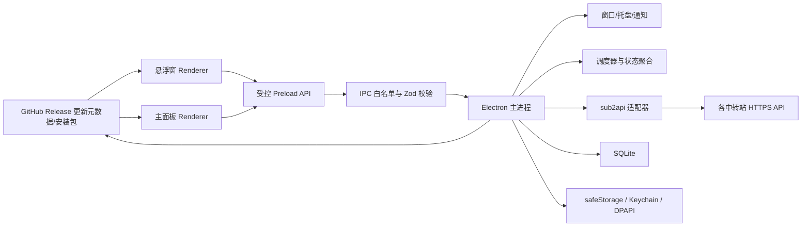
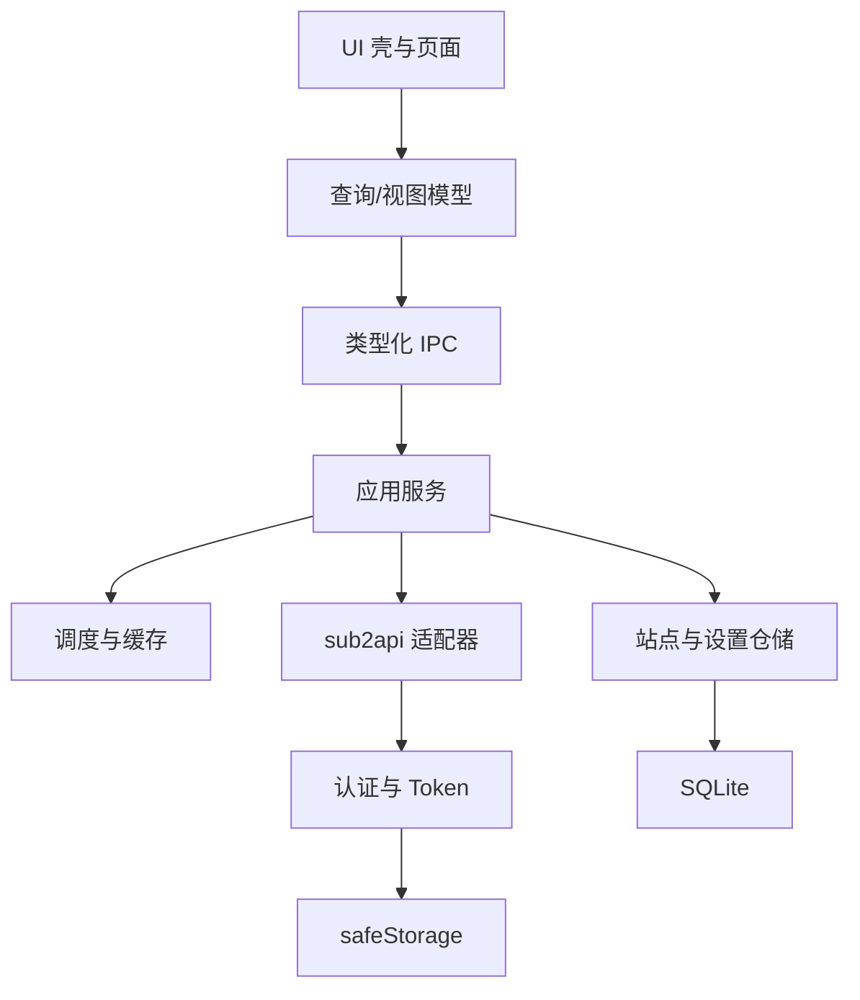
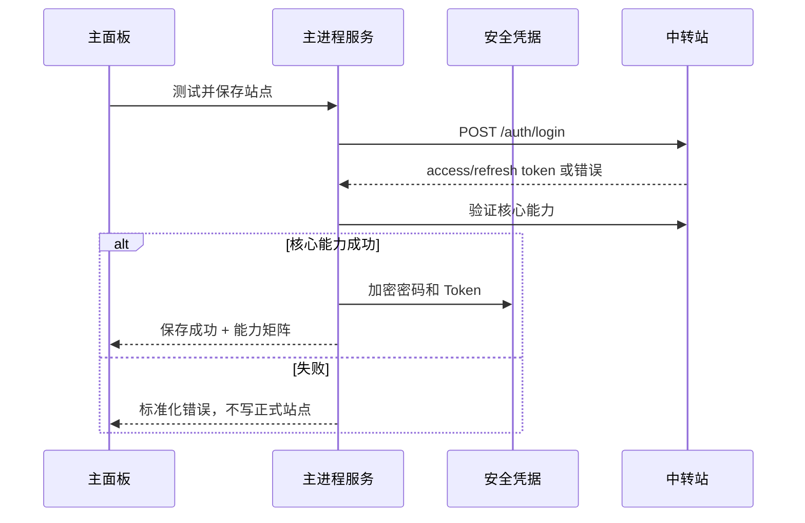
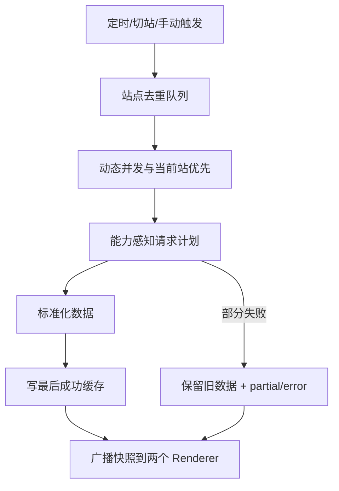

# 架构文档

## 2026-08-05 1.7.12 浏览器边界收口

Turnstile 路径由 `runChromeInteractiveAuthentication` 启动系统 Google Chrome、独立临时 Profile 和随机回环 CDP；CDP 只读取目标 origin 的有限认证 Token。GeeTest 路径继续使用临时 sandboxed Electron `BrowserWindow`，但不再调用 `setUserAgent`、`Network.setUserAgentOverride`、`Page.addScriptToEvaluateOnNewDocument`、`Target.attachToTarget` 或脚本改写 `navigator`。

两条路径都保留同源顶层导航/重定向限制、无 preload、Token 白名单、用户本人完成挑战、核心接口验证后再原子保存，以及取消、超时、网络失败不保存半成品的安全边界。

## 2026-08-04 1.7.3 认证会话与站点生命周期收口

交互 Token 提取器允许 `accessToken` 单独存在，`refreshToken` 只作为可选字段；保存门禁仍执行 `readCore()` 和按 Key 今日统计。官方窗口同时监听 `will-navigate` 与 `will-redirect`，只允许目标 origin 的顶层导航，挑战 iframe 不改变该边界。

`reverifyWithInteractiveSession` 在写入凭据后任一步骤失败时恢复旧凭据、SQLite 快照/Key 设置和所有站点运行态 Map；`deleteSite` 以 `siteId` 清理快照、刷新单飞、Key 用量缓存、通知规则及当前站点引用，避免同地址多账号之间相互污染。

## 2026-08-04 1.7.2 交互错误与渠道回退

HTTP 适配器在读取登录响应后先执行有限 provider 分类，再执行登录 schema；因此 2xx 交互错误包不会被当作有效 session。错误对外只保留 `INTERACTIVE_VERIFICATION_REQUIRED`、provider 和安全 HTTP 状态。

`ChannelStatusPopover` 使用最近成功缓存和稳定的选中 ID ref。强制刷新先展示旧内容并标记 refreshing，异常时恢复旧详情并标记 stale；成功响应才替换列表和详情缓存。`SiteService.verifyAndSave` 使用串行保存队列，并在安全存储或数据库写入失败时清理 siteId 相关持久化和内存状态。

## 2026-08-03 1.7.1 交互窗口客户端兼容性（历史，已由 1.7.12 收口）

历史版本曾在 Electron 官方窗口移除 Electron User-Agent 标记。1.7.12 已撤销该伪装逻辑：GeeTest 窗口现在使用原生 Electron 浏览器标识；Cloudflare Turnstile 改由系统 Google Chrome 独立临时 Profile 承接。挑战网络修复、临时 session、同源顶层导航、Token 白名单、用户本人验证和失败不落盘边界继续有效。

## 2026-08-03 1.7.0 交互认证与站点身份架构（当前有效）

### 认证状态机

`public-settings-detect → password-login | verification-required → official-login-window → core-session-validation → save-site`。适配器只输出 `geetest`、`turnstile` 两种 provider 或普通认证错误；主进程 `SiteService` 统一执行核心验证和保存，Renderer 不拥有 Token 或站点页面。

- `Sub2ApiClient.authenticationMode()` 只读取 `/settings/public` 的公开开关；登录错误分类保留真实 HTTP 状态，并从有限错误码/消息提取 provider。
- `interactive-auth-window` 使用随机临时 partition、sandbox、contextIsolation、无 preload、同源顶层导航和 Token 白名单；成功后销毁窗口并清理 session。
- `sites:add-with-interactive-verification` 与 `sites:reverify` 只接受固定输入；Token 进入 `readCore()`/按 Key 统计门禁后才写入 `CredentialVault`。交互会话失败不会改变原站点凭据。

### 站点身份与数据隔离

`normalizeSiteUrl(baseUrl) + normalizeAccountIdentity(account)` 是重复站点判定键。保存前后各校验一次，账号标签只存脱敏引用；所有运行态 Map、SQLite setting key、通知 ID 和渠道缓存都以 `siteId` 为第一分区键，允许同一地址挂载多个不同用户名。

### 状态通知与渠道缓存

Renderer 通过 `notifications.tsx` 的单一 Provider 承载短暂操作状态；长期渠道状态留在页面 ViewModel。渠道 loader 使用 stale-while-revalidate，按 `siteId:channelId` 做请求世代和缓存校验，刷新失败不清空旧摘要或手动关系；只有首次无缓存失败才进入完整错误态。

## 2026-07-23 规划架构增量

### 新的数据边界

- `Sub2ApiAdapter` 负责分页读取 Key、脱敏完整 key、读取可用分组/倍率/批量消费/每日消费、执行最小分组写入并回读；不得把完整 key 返回服务层。
- `SiteService` 负责站点会话、Key 管理聚合、所选 Key 统计、渠道轮询缓存、single-flight、并发和退避；远程数据按 siteId 分区。
- `electron/shared/contracts.ts` 负责 Key 列表/详情、写入命令、筛选统计、结构化 channel-group 关系和轮询状态的严格契约；未知上游字段在适配器层丢弃。
- preload 只暴露固定的 `apiKeys`、usage stats 和渠道调度操作，不暴露任意路径、HTTP 方法、Token 或完整 Key。
- Renderer 只持有脱敏 ViewModel、请求世代和局部交互状态；不直接访问网络和敏感存储。

### API 密钥数据流

`ApiKeysPage → preload → IPC schema → SiteService → Sub2ApiAdapter → sub2api 用户接口`。列表基础数据先返回；今日批量消费与近 30 天消费可分阶段合并。切组使用 per-site/per-key 写锁，写成功后回读；只有回读 `group_id` 等于目标才广播 `keys:changed` 并使 Key 汇总、渠道关联和使用记录选项缓存失效。

### 使用记录联动流

Renderer 把一个规范化查询对象同时发送给 usage list 和 usage stats。300ms 防抖只属于选择变化；手动刷新绕过防抖。每次查询生成 revision 和 AbortSignal，只有 `siteId + revision` 仍为当前值时才能提交列表与统计。列表失败和统计失败分区显示，不得用另一方结果伪装成功。

### 所选 Key 汇总流

每站先由既有 KeyPreference 解析当前 Key，再调用单 Key stats。跨站没有上游统一接口，主进程按站点受控并发聚合。汇总缓存键至少包含 siteId、keyId、本地日期和 Key/分组修订号；Key 选择、分组切换、跨日或强制刷新时失效。

### 渠道实时流

主窗口向主进程报告相关 surface 的可见订阅，调度器只在至少一个订阅存在且窗口可见时运行。列表缓存按 siteId，详情按 `siteId:monitorId`；列表周期默认 60 秒，详情按需。调度器统一完成 single-flight、全局并发 2、错峰、抖动、Retry-After 和指数退避，Renderer 不自行创建每卡计时器。

### Key-渠道关系流

适配器保留 `/channels/available` 的 channel name、platform、`groups[].id/name` 和 models。解析器先按 groupId 定位渠道关系，再把渠道关系映射到 monitor；兼容路径必须返回 `matched/unmatched/ambiguous` 及匹配依据。健康状态、加载错误、关联结果和新鲜度使用不同字段，禁止互相覆盖。

### 计划中的 Renderer 文件边界

- 新建 `src/renderer/shells/api-keys/ApiKeysPage.tsx`、`types.ts`、`api-keys.css` 和定向测试；不在本阶段创建。
- 更新 `App.tsx` 与 preview types 以增加导航、站点切换、Key 页面状态和事件。
- 更新 usage、overview、channels 现有壳；局部样式文件承担所有新样式，禁止修改全局表格、按钮和主题规则。

上级：[[00-项目说明书]]、[[01-需求文档]]
下级：[[03-索引]]、[[06-数据字典]]、[[07-API文档]]
依赖：Electron、React、SQLite、sub2api HTTP API

## 技术基线

Electron + React + TypeScript + Vite；TanStack Query 管理渲染端异步视图；Zod 校验 IPC 和外部响应；SQLite 保存非敏感持久数据；Electron `safeStorage` 保护密码和 Token；Vitest、mock 服务和 Playwright Electron 负责内部验证；electron-builder 与 CI 负责双平台构建。

当前已安装并验证 Electron、React、TypeScript、Vite、TanStack Query、Zod、Vitest、Playwright Electron 和 electron-builder 工程基线。SQLite、safeStorage、受控业务 IPC、HTTP 适配、认证、调度、缓存、通知、窗口设置和六个主导航业务界面的真实接线已存在并通过自动化、macOS 打包应用和页面样式验证。根目录已生成 macOS ARM64 DMG 与 Windows x64 NSIS；macOS bundle 使用完整 ad-hoc 签名但尚无 Apple Developer ID 签名和公证，Windows 仅交叉构建，对外 Release 分发仍属后续范围。

## 进程边界

### 主进程职责

- 应用生命周期、单实例、窗口、托盘、开机启动、通知。
- 站点、凭据、Token、SQLite 和缓存。
- HTTP、认证续期、能力探测、调度、聚合和错误标准化。
- IPC 权限边界和日志脱敏。

### 在线更新边界

- `UpdateService` 只接受固定 GitHub HTTPS manifest，负责稳定通道版本比较、平台/架构匹配、SHA-256 校验、下载进度和错误标准化；Gitee 仅作为源码镜像，不承载安装包，不依赖 electron-builder feed。
- preload 只暴露检查、下载、安装、打开 DMG、跳过版本、稍后提醒和进度/错误事件；不暴露 Node 文件系统、任意 URL 下载或完整安装包路径写入能力。
- Renderer 只展示状态。版本徽标和设置区共用同一状态机：idle/checking/available/downloading/downloaded/installing/restarting/no-update/skipped/remind-later/error/macos-manual。
- 更新设置与 SQLite 的普通 settings 同层保存，但不保存凭据；旧版本升级必须保持现有 schema 兼容，不把更新元数据写入业务表。
- Windows 的自动安装/重启和 macOS 的 DMG 降级是两个平台策略，业务 IPC、Renderer 状态和错误语义共用，原生安装动作分平台实现。
- 更新服务不得执行远程脚本、加载远程 Renderer 资源或把更新说明当作 HTML/代码执行。

### Renderer 职责

- 展示视图、筛选器、分页、交互状态和局部 UI 状态。
- 通过 preload 暴露的最小 API 发起意图，不读取原始密码或 Token。
- 不自行拼接任意站点请求，不持有完整 API Key。
- 渠道列表和详情通过 Renderer 共享 `RateChannelStatusLoader` 访问：按站点/渠道缓存、single-flight、详情并发 4、force revision 隔离旧响应。全部站点摘要、渠道页面、快捷弹窗和倍率稳定性核验复用同一份标准化渠道数据。
- 分组与监控关系集中在 `channel-ranking.ts`，平台证据和评分集中在 `rate-comparison.ts`；页面组件不得自行实现名称包含、ID 比较或另一套平台归类。

## 模块分层

## 认证流

正常刷新优先使用 access token；401 时单飞刷新 refresh token，刷新失败后才读取加密密码重登。多请求遇到 401 时必须合并刷新，避免刷新风暴。

## 刷新与缓存流

- 调度器只在主进程存在一份，避免主面板和悬浮窗重复轮询。
- 站点刷新有互斥锁；手动刷新提高优先级但服从防连点。
- 缓存记录 `fetchedAt`、`expiresAt`、来源、能力错误和站点时区口径。

## 窗口流

- 首次/无站点：打开主面板录入页，悬浮窗窗口已创建但默认隐藏。
- 正常启动：主面板按保存的可见 bounds 打开；不可见位置回退主显示器工作区。
- 主面板最小化：悬浮窗启用时隐藏主窗并显示悬浮窗；悬浮窗禁用时隐藏主窗到托盘。preload 保证尚未完成的设置写入先于最小化命令。
- 主面板关闭：调用 `app.quit()` 真正退出，不继续驻留后台。托盘“退出”使用同一退出语义。
- 悬浮窗固定为 `380 x 260`，以工作区 12px 边距停靠左上、右上、左下或右下，默认右上并写入 SQLite。所有平台保持 `alwaysOnTop=false`，切换应用不调用 `hide()` 或 `minimize()`，常驻显示统一使用 `showInactive()`，不把应用激活到前台，因此窗口继续存在但可被浏览器等前台应用覆盖。macOS 额外使用 `setVisibleOnAllWorkspaces(true, { visibleOnFullScreen: false })` 适配台前调度和 Space；Windows 不启用跨工作区或全屏覆盖。
- `1440 x 1024` 只作为 Stitch 视觉参考。主 `BrowserWindow` 初始按工作区 `60% x 90%` 创建并居中，Renderer 响应式铺满内容区；侧栏使用 fixed 定位，右侧内容独立滚动。

## 通知流

标准化快照进入规则引擎，比较上次通知状态、阈值和冷却窗口；满足条件后调用系统通知。通知只包含站点显示名、事件类型和安全摘要。余额、站点异常、渠道异常、恢复通知和冷却时间均持久化；Electron 只诚实暴露系统是否支持通知，不伪造操作系统授权状态。

## 安全设计

- `contextIsolation: true`，Renderer 不启用 Node integration。
- preload 只暴露命名方法；IPC channel 固定，参数与返回使用 Zod。
- 禁止任意导航、新窗口和非白名单外部 URL；外部链接交给系统浏览器。
- 设置 CSP，限制脚本、连接和资源来源。
- 数据库不存明文密码/Token；日志统一经过 redactor。
- API Key 仅保存服务端 ID、名称、状态、分组和脱敏显示信息。
- 删除站点必须事务化删除普通数据并调用安全凭据删除。

## 跨平台边界

- macOS：Keychain、通知中心、登录项、菜单栏/托盘、无框窗口，以及台前调度下“跨 Space 保持存在、前台应用可覆盖、不覆盖全屏应用”的窗口策略需打包应用真机验证。
- Windows：DPAPI、通知、托盘、登录项在 CI 验证可执行路径；最终不标真机通过。
- 未签名分发的系统警告记录在分发文档，不通过代码绕过系统安全策略。

## 2026-07-18 外发版功能合并架构增量

### Radar 嵌入流（1.9.3）

Radar 是正式主导航中的入口选择页，不再读取 `current.json` 或构建本地模型数据。站点列表保存在 SQLite `settings` 表 `radar:entries`，结构为 `{ id, label, url }[]`；首次无设置时返回两个默认项，空数组保持为空。Renderer 通过受控 `radar:list`、`radar:create`、`radar:delete`、`radar:open`、`radar:close` 操作；主进程校验发送者、条目 ID、名称、HTTPS URL、重复项和 50 项上限，并为新增项生成稳定 ID。

打开时 Renderer 只发送不透明 ID，主进程重新读取持久化 URL 后，在当前主 `BrowserWindow` 的内容区挂载独立 `WebContentsView`。远程视图使用 sandbox、contextIsolation、nodeIntegration=false 和独立内存 partition，不注入项目 preload，不接触站点凭据、业务 IPC 或本地文件。

远程视图的顶层导航只允许当前目标 HTTPS origin 内的路径、查询和 fragment，新窗口和额外 webview 均拒绝；主窗口 resize、关闭、应用退出、远程视图销毁和 `Esc` 都由主进程清理。应用自己的 toolbar 与右上角关闭按钮保留在 WebContentsView 上方，加载失败时移除远程视图并由 Renderer 显示可恢复错误状态。主应用 CSP 不再放行 Radar 外部连接，远程站点使用自身会话和策略。

### 使用记录字段流

上游 usage 响应由 `sub2api-adapter.ts` 在主进程丢弃未知和敏感字段后，归一化为共享契约允许的 `reasoningEffort`、缓存创建 Token 和 `durationMs`。Zod 契约、preload 返回类型、Renderer ViewModel、CSV 映射必须保持同一字段语义；缺失字段使用 `undefined` 或零值的既有约定，不在 Renderer 猜测。

### 渠道关系与并发流

适配器可选读取 `/channels/available`，只保留渠道名、平台、分组名和模型名等非敏感关系。Renderer 使用显式的站点请求令牌和当前站点 ID 校验渠道列表、详情和定时刷新响应；关系匹配出现零个或多个候选时保持未确定，不强行绑定。该关系数据不改变远程站点，只用于排序和展示。

### 悬浮窗透明度流

透明度设置通过现有设置 IPC 进入 Zod 边界，范围限制在 `35..100`，持久化到 SQLite 设置表；主进程将百分比转换为 Electron 原生 opacity，Renderer 只负责控件和数值反馈。窗口显示/隐藏路径继续使用主线的非激活策略，朋友版曾恢复的 `show() + focus()` 不得移植。

### 跨平台构建边界

业务代码和 IPC 契约必须在 macOS/Windows 共用；平台差异仅限原生窗口能力、系统存储/通知/登录项和 electron-builder target。macOS 目标保持 `arm64`，Windows 目标保持 `x64 nsis`。Universal macOS 不是本项目当前发布目标。Windows 证据仅包括交叉构建、PE/NSIS 结构和自动化路径，不能替代 Windows 真机验收。

## 2026-08-09 2.0.0 Sub2API 服务器管理与修复架构增量

### Sub2API 服务器管理流

- 新增独立共享契约 `electron/shared/sub2api-server.ts` 与主进程服务，不把私有服务器数据写入 Radar `radar:entries` 或修改 Radar 公开网页策略。
- 数据保存在 SQLite `settings` 表 `sub2api-servers:entries`，结构为 `{ id, name, baseUrl, loginRule?, shortcuts[], loginState, seenLoggedIn, createdAt, updatedAt, partitionId }[]`；数组顺序即显示顺序，不额外建表。
- IPC 使用 `sub2api-servers:list/create/update/delete/open/close/back/forward/reload/home/clear-session/onStateChange`；Renderer 只传不透明 ID 与输入，主进程重新读取持久化 URL。
- 主进程创建基于稳定 ID 的独立 `persist:sub2api-server-<id>` partition；每个服务器隔离 Cookie/LocalStorage/IndexedDB/Cache。远程视图安全参数、同源导航白名单、新窗口/额外 webview 拒绝、resize 同步和退出清理与 Radar 一致，但登录状态必须单独维护。
- 登录状态只存非敏感枚举与 `seenLoggedIn`，通过主帧 `did-navigate` 响应码、登录路由识别和已登录标记推断；不保存网页密码、Cookie/Token 或完整 URL。

### favicon 元数据流

- `SiteService` 在所有成功添加路径返回前调用 `safeAttachMetadata(siteId)`：已有 icon 跳过，失败吞掉并回退占位；批量任务逐项在 success 前回填。
- 启动时 `startMetadataBackfill()` 扫描 `db.listSites()` 缺失 icon 的站点，每站用 `site:<id>:metadataBackfillAttempted` 标记一次性尝试，并发上限 2。

### 现有问题修复流

- 无渠道推荐只按规范化后的 API/分组名称过滤禁用词，不改变真实渠道候选路径。
- 渠道稳定性先看最近一分钟可靠时间线，再回退顶层状态，避免旧顶层失败覆盖近期正常/降级。
- 全部站点时间线统一使用排序、过滤和最近 N 条显示函数，保证最右为最新且不溢出。
- 悬浮窗展示 20 格时间线，百分比分母固定为最新 12 条真实记录；余额只在当前 Key 成功且可用额度为金额时展示，否则显示 `—`。
- 登录过期由 `sites:refresh-state` 的 `auth-required` 事件触发稳定 ID 通知；菜单映射调整为“通知→通知规则”“设置→通用设置”。
