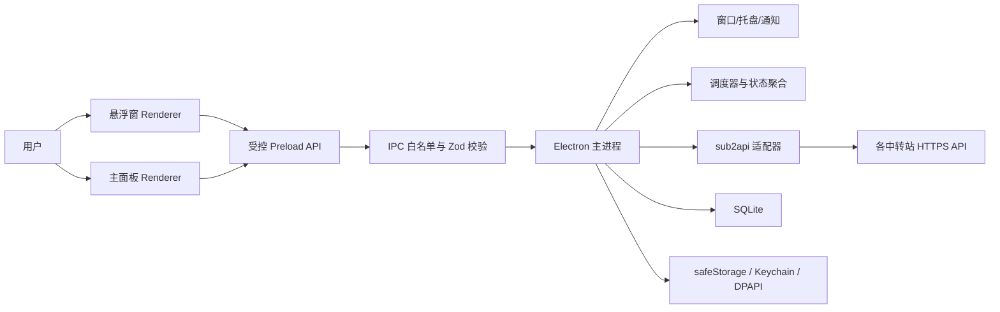
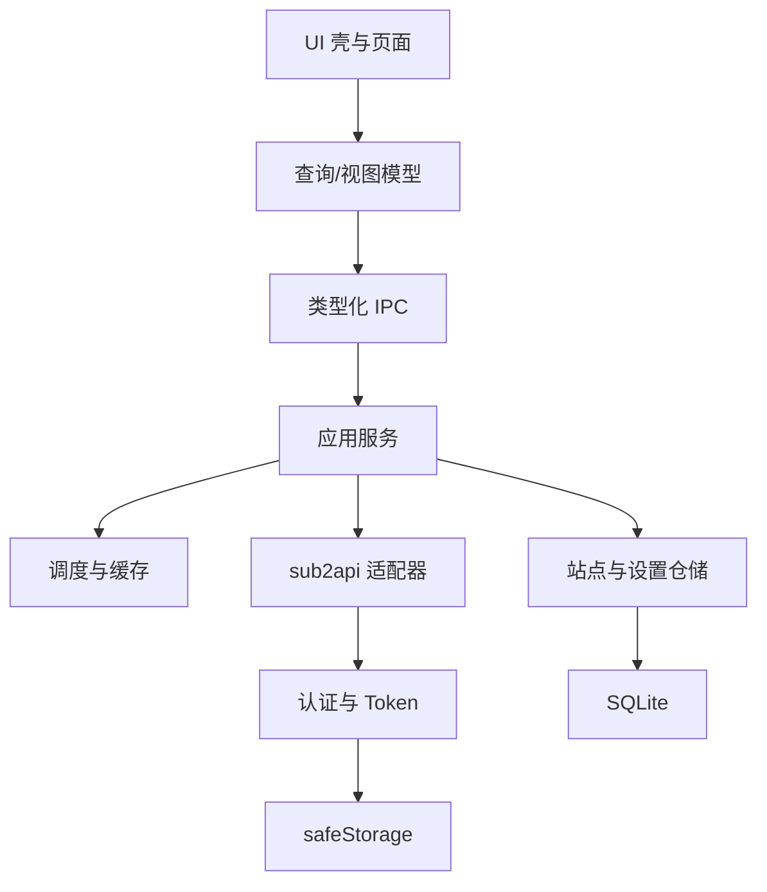
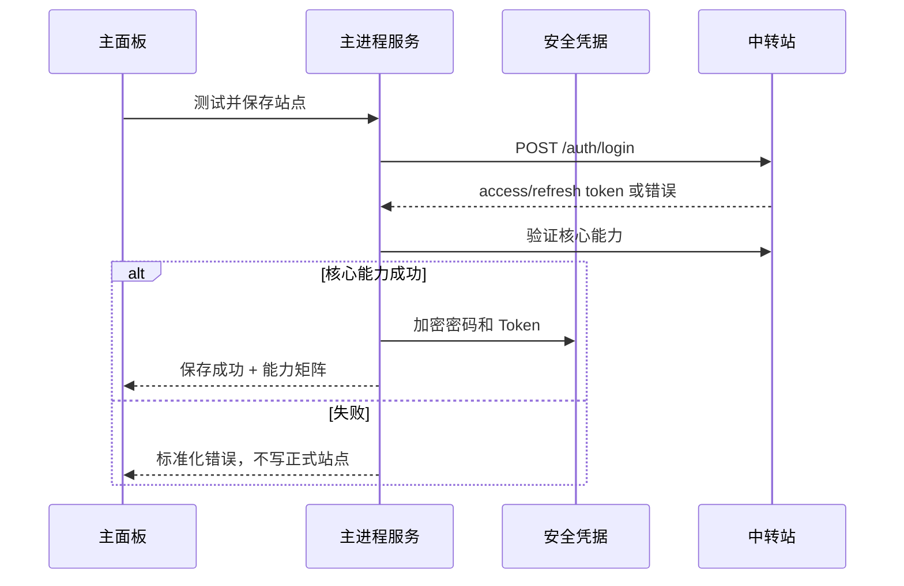
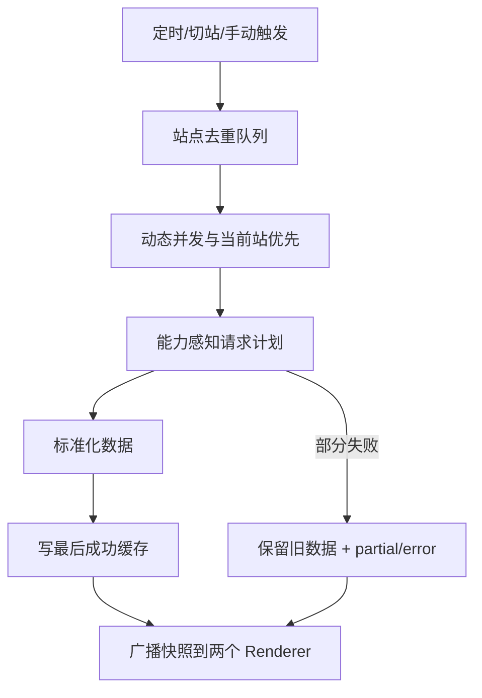

# 架构文档

上级：[[00-项目说明书]]、[[01-需求文档]]
下级：[[03-索引]]、[[06-数据字典]]、[[07-API文档]]
依赖：Electron、React、SQLite、sub2api HTTP API

## 技术基线

Electron + React + TypeScript + Vite；TanStack Query 管理渲染端异步视图；Zod 校验 IPC 和外部响应；SQLite 保存非敏感持久数据；Electron `safeStorage` 保护密码和 Token；Vitest、mock 服务和 Playwright Electron 负责内部验证；electron-builder 与 CI 负责双平台构建。

当前已安装并验证 Electron、React、TypeScript、Vite、TanStack Query、Zod、Vitest、Playwright Electron 和 electron-builder 工程基线。SQLite、safeStorage、受控业务 IPC、HTTP 适配、认证、调度、缓存、通知、窗口设置和五个业务界面的真实接线已存在并通过自动化、macOS 打包应用和页面样式验证。根目录已生成 macOS ARM64 DMG 与 Windows x64 NSIS；Windows 仅交叉构建，签名、公证和对外发布仍属后续范围。

## 进程边界

### 主进程职责

- 应用生命周期、单实例、窗口、托盘、开机启动、通知。
- 站点、凭据、Token、SQLite 和缓存。
- HTTP、认证续期、能力探测、调度、聚合和错误标准化。
- IPC 权限边界和日志脱敏。

### Renderer 职责

- 展示视图、筛选器、分页、交互状态和局部 UI 状态。
- 通过 preload 暴露的最小 API 发起意图，不读取原始密码或 Token。
- 不自行拼接任意站点请求，不持有完整 API Key。
- 渠道列表和详情通过 Renderer 共享 `RateChannelStatusLoader` 访问：按站点/渠道缓存、single-flight、详情并发 4、force revision 隔离旧响应。全部站点摘要、渠道页面、快捷弹窗和倍率稳定性核验复用同一份标准化渠道数据。
- 分组与监控关系集中在 `channel-ranking.ts`，平台证据和评分集中在 `rate-comparison.ts`；页面组件不得自行实现名称包含、ID 比较或另一套平台归类。

## 模块分层

## 认证流

正常刷新优先使用 access token；401 时单飞刷新 refresh token，刷新失败后才读取加密密码重登。多请求遇到 401 时必须合并刷新，避免刷新风暴。

## 刷新与缓存流

- 调度器只在主进程存在一份，避免主面板和悬浮窗重复轮询。
- 站点刷新有互斥锁；手动刷新提高优先级但服从防连点。
- 缓存记录 `fetchedAt`、`expiresAt`、来源、能力错误和站点时区口径。

## 窗口流

- 首次/无站点：打开主面板录入页，悬浮窗窗口已创建但默认隐藏。
- 正常启动：主面板按保存的可见 bounds 打开；不可见位置回退主显示器工作区。
- 主面板最小化：悬浮窗启用时隐藏主窗并显示悬浮窗；悬浮窗禁用时隐藏主窗到托盘。preload 保证尚未完成的设置写入先于最小化命令。
- 主面板关闭：调用 `app.quit()` 真正退出，不继续驻留后台。托盘“退出”使用同一退出语义。
- 悬浮窗固定为 `380 x 260`，以工作区 12px 边距停靠左上、右上、左下或右下，默认右上并写入 SQLite。所有平台保持 `alwaysOnTop=false`，切换应用不调用 `hide()` 或 `minimize()`，常驻显示统一使用 `showInactive()`，不把应用激活到前台，因此窗口继续存在但可被浏览器等前台应用覆盖。macOS 额外使用 `setVisibleOnAllWorkspaces(true, { visibleOnFullScreen: false })` 适配台前调度和 Space；Windows 不启用跨工作区或全屏覆盖。
- `1440 x 1024` 只作为 Stitch 视觉参考。主 `BrowserWindow` 初始按工作区 `60% x 90%` 创建并居中，Renderer 响应式铺满内容区；侧栏使用 fixed 定位，右侧内容独立滚动。

## 通知流

标准化快照进入规则引擎，比较上次通知状态、阈值和冷却窗口；满足条件后调用系统通知。通知只包含站点显示名、事件类型和安全摘要。余额、站点异常、渠道异常、恢复通知和冷却时间均持久化；Electron 只诚实暴露系统是否支持通知，不伪造操作系统授权状态。

## 安全设计

- `contextIsolation: true`，Renderer 不启用 Node integration。
- preload 只暴露命名方法；IPC channel 固定，参数与返回使用 Zod。
- 禁止任意导航、新窗口和非白名单外部 URL；外部链接交给系统浏览器。
- 设置 CSP，限制脚本、连接和资源来源。
- 数据库不存明文密码/Token；日志统一经过 redactor。
- API Key 仅保存服务端 ID、名称、状态、分组和脱敏显示信息。
- 删除站点必须事务化删除普通数据并调用安全凭据删除。

## 跨平台边界

- macOS：Keychain、通知中心、登录项、菜单栏/托盘、无框窗口，以及台前调度下“跨 Space 保持存在、前台应用可覆盖、不覆盖全屏应用”的窗口策略需打包应用真机验证。
- Windows：DPAPI、通知、托盘、登录项在 CI 验证可执行路径；最终不标真机通过。
- 未签名分发的系统警告记录在分发文档，不通过代码绕过系统安全策略。

## 2026-07-18 外发版功能合并架构增量

### Radar 数据流

Radar 是 Renderer 内的独立主导航页面，不经过站点凭据、主进程业务 IPC 或 SQLite。页面只通过浏览器 `fetch` 读取 `https://codexradar.com/current.json`，在本地完成排序、性价比计算、推理等级标签和推荐文案。CSP 只增加该明确 HTTPS origin；错误和空数据只影响 Radar 页面，不影响站点刷新调度。

### 使用记录字段流

上游 usage 响应由 `sub2api-adapter.ts` 在主进程丢弃未知和敏感字段后，归一化为共享契约允许的 `reasoningEffort`、缓存创建 Token 和 `durationMs`。Zod 契约、preload 返回类型、Renderer ViewModel、CSV 映射必须保持同一字段语义；缺失字段使用 `undefined` 或零值的既有约定，不在 Renderer 猜测。

### 渠道关系与并发流

适配器可选读取 `/channels/available`，只保留渠道名、平台、分组名和模型名等非敏感关系。Renderer 使用显式的站点请求令牌和当前站点 ID 校验渠道列表、详情和定时刷新响应；关系匹配出现零个或多个候选时保持未确定，不强行绑定。该关系数据不改变远程站点，只用于排序和展示。

### 悬浮窗透明度流

透明度设置通过现有设置 IPC 进入 Zod 边界，范围限制在 `35..100`，持久化到 SQLite 设置表；主进程将百分比转换为 Electron 原生 opacity，Renderer 只负责控件和数值反馈。窗口显示/隐藏路径继续使用主线的非激活策略，朋友版曾恢复的 `show() + focus()` 不得移植。

### 跨平台构建边界

业务代码和 IPC 契约必须在 macOS/Windows 共用；平台差异仅限原生窗口能力、系统存储/通知/登录项和 electron-builder target。macOS 目标保持 `arm64`，Windows 目标保持 `x64 nsis`。Universal macOS 不是本项目当前发布目标。Windows 证据仅包括交叉构建、PE/NSIS 结构和自动化路径，不能替代 Windows 真机验收。
