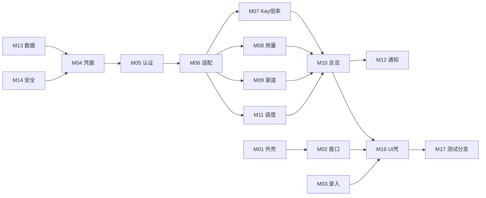

# liran_docs 中心索引

上级：[[00-项目说明书]]
下级：全部规划文档与模块
依赖：[[01-需求文档]]、[[02-架构文档]]

本文件是文档结构、模块依赖和需求追踪的单一事实来源。后续增加、移动或重命名文档时必须先更新本索引。当前工程基线、业务接线、2026-07-14 深度优化、macOS 打包应用适用项、两站只读复测、页面样式检查和双平台产物审计已有证据；Windows 真机、签名、公证、CI 和 Gitee 分发仍未完成。

## 核心文档

| 文档                                                                   | 用途                                               |
| ---------------------------------------------------------------------- | -------------------------------------------------- |
| [用户原话.md](用户原话.md)                                             | 首次原话、确认结果和来源边界                       |
| [00-项目说明书.md](00-项目说明书.md)                                   | 项目目标、用户、范围和完成定义                     |
| [01-需求文档.md](01-需求文档.md)                                       | RQ-01 至 RQ-19 产品需求与规则                      |
| [02-架构文档.md](02-架构文档.md)                                       | 进程、模块、数据流、认证流和安全边界               |
| [04-开发追踪.md](04-开发追踪.md)                                       | 15 阶段、微观任务和实施门禁                        |
| [05-术语表.md](05-术语表.md)                                           | 统一术语与状态定义                                 |
| [06-数据字典.md](06-数据字典.md)                                       | 逻辑实体、敏感级别、存储与生命周期                 |
| [07-API文档.md](07-API文档.md)                                         | 上游源码接口证据与真实站待验证项                   |
| [08-测试用例.md](08-测试用例.md)                                       | 自动化、macOS、Windows CI 和视觉用例               |
| [09-真机实测.md](09-真机实测.md)                                       | Codex macOS 真机验收清单，严格门禁已通过           |
| [10-UI壳接入清单.md](10-UI壳接入清单.md)                               | UI 壳总范围、Stitch 路线和准备门禁                 |
| [ui-shells/_README.md](ui-shells/_README.md)                           | 五个单壳清单与 Stitch 映射说明                     |
| [Stitch 产物登记](stitch-artifacts/README.md)                          | Project、5 个业务 Screen、Design System 和下载来源 |
| [主框架与全站总览清单](ui-shells/应用主框架与全站总览-UI壳接入清单.md) | 全部站点 Screen 与施工白名单                       |
| [使用记录清单](ui-shells/使用记录-UI壳接入清单.md)                     | 使用记录 Screen 与施工白名单                       |
| [渠道状态清单](ui-shells/渠道状态-UI壳接入清单.md)                     | 渠道状态 Screen 与施工白名单                       |
| [站点与设置清单](ui-shells/站点录入管理与设置-UI壳接入清单.md)         | 站点管理与设置 Screen 及施工白名单                 |
| [悬浮窗清单](ui-shells/悬浮窗-UI壳接入清单.md)                         | 悬浮窗 Screen 与独立 Renderer 规格                 |

## 真实 UI 壳施工入口

| 入口            | 文件                                            | 状态                             |
| --------------- | ----------------------------------------------- | -------------------------------- |
| Renderer 根入口 | `src/renderer/main.tsx`、`src/renderer/App.tsx` | 正式导航与业务 ViewModel 已接线  |
| 受控预览与状态  | `src/renderer/preview/`                         | 仅开发预览；生产不显示           |
| 总览壳          | `src/renderer/shells/overview/`                 | 接线内部测试及 macOS 适用项通过  |
| 使用记录壳      | `src/renderer/shells/usage/`                    | 接线内部测试及 macOS 适用项通过  |
| 渠道状态壳      | `src/renderer/shells/channels/`                 | 接线通过；真实扩展指标待站点提供 |
| 站点与设置壳    | `src/renderer/shells/sites/`                    | 接线及 macOS 隔离删站通过        |
| 悬浮窗壳        | `src/renderer/shells/floating/`                 | 接线内部测试及 macOS 适用项通过  |

## 模块树

| 模块                      | 文档                                                               | 需求                    | 直接依赖             | 状态                     |
| ------------------------- | ------------------------------------------------------------------ | ----------------------- | -------------------- | ------------------------ |
| M01 应用外壳与生命周期    | [模块文档](modules/01-应用外壳与生命周期/_应用外壳与生命周期.md)   | RQ-12,RQ-18,RQ-19       | M13,M14              | 真机测试通过（适用项）   |
| M02 窗口悬浮窗与托盘      | [模块文档](modules/02-窗口悬浮窗与托盘/_窗口悬浮窗与托盘.md)       | RQ-03,RQ-11,RQ-12       | M01,M11              | 真机测试通过（适用项）   |
| M03 站点管理与首次引导    | [模块文档](modules/03-站点管理与首次引导/_站点管理与首次引导.md)   | RQ-01,RQ-16             | M04,M05,M06          | 真机测试通过             |
| M04 站点安全凭据          | [模块文档](modules/04-常用账号与安全凭据/_常用账号与安全凭据.md)   | RQ-14,RQ-15             | M13,M14              | 真机测试通过（macOS）    |
| M05 认证与 Token 生命周期 | [模块文档](modules/05-认证与Token生命周期/_认证与Token生命周期.md) | RQ-01,RQ-14,RQ-16       | M04,M06              | 真机测试通过（macOS）    |
| M06 API 适配器与能力探测  | [模块文档](modules/06-API适配器与能力探测/_API适配器与能力探测.md) | RQ-01,RQ-05..08,RQ-16   | M05                  | 真机测试通过（只读）     |
| M07 API Key 与倍率        | [模块文档](modules/07-API-Key与倍率/_API-Key与倍率.md)             | RQ-04,RQ-05             | M06,M08              | 真机测试通过（适用项）   |
| M08 今日统计与使用记录    | [模块文档](modules/08-今日统计与使用记录/_今日统计与使用记录.md)   | RQ-06,RQ-07             | M06,M07              | 真机测试通过             |
| M09 渠道状态              | [模块文档](modules/09-渠道状态/_渠道状态.md)                       | RQ-08,RQ-16             | M06,M11              | 真机测试通过（缺失态）   |
| M10 全站总览与汇总        | [模块文档](modules/10-全站总览与汇总/_全站总览与汇总.md)           | RQ-09,RQ-11             | M07,M08,M09,M11      | 真机测试通过             |
| M11 调度缓存与退避        | [模块文档](modules/11-调度缓存与退避/_调度缓存与退避.md)           | RQ-10,RQ-11             | M06,M13              | 真机测试通过（适用项）   |
| M12 通知                  | [模块文档](modules/12-通知/_通知.md)                               | RQ-13                   | M10,M13              | 真机测试通过（受控态）   |
| M13 本地数据生命周期      | [模块文档](modules/13-本地数据生命周期/_本地数据生命周期.md)       | RQ-14                   | 数据字典             | 真机测试通过（macOS）    |
| M14 IPC 安全与日志        | [模块文档](modules/14-IPC安全与日志/_IPC安全与日志.md)             | RQ-15,RQ-18             | 架构、数据字典       | 真机测试通过             |
| M15 设置导出与删除        | [模块文档](modules/15-设置导出与删除/_设置导出与删除.md)           | RQ-10,RQ-13,RQ-14,RQ-19 | M04,M13              | 真机测试通过（已实现项） |
| M16 UI 壳与 Stitch        | [模块文档](modules/16-UI壳与Stitch/_UI壳与Stitch.md)               | RQ-17                   | 全业务模块、UI总清单 | 真机测试通过（适用项）   |
| M17 测试构建与分发        | [模块文档](modules/17-测试构建与分发/_测试构建与分发.md)           | RQ-18,RQ-19             | 全模块               | 本轮收口；CI/发布待开发  |

## 横向依赖总表

M05 与 M06 的表面双向关系通过接口倒置解除：M06 提供低层无认证 HTTP 运输和端点描述，M05 管理 Token，再由认证装饰器组合成完整客户端。实现时禁止形成模块循环导入。

## 需求追踪矩阵

| 需求  | 模块            | 任务                                                   | 测试      |
| ----- | --------------- | ------------------------------------------------------ | --------- |
| RQ-01 | M03,M05,M06     | TASK-03-04..06,TASK-04-01..04,TASK-07-02/03,TASK-10-01 | TC-01A..F |
| RQ-03 | M02             | TASK-06-01..03,TASK-10-03,TASK-13-02                   | TC-03A..F |
| RQ-04 | M07             | TASK-05-01..03,TASK-10-02                              | TC-04A..G |
| RQ-05 | M06,M07         | TASK-04-04,TASK-05-04,TASK-10-02                       | TC-05A..D |
| RQ-06 | M08             | TASK-04-05,TASK-05-05,TASK-10-03                       | TC-06A..E |
| RQ-07 | M08             | TASK-07-05,TASK-10-04/05,TASK-12-03                    | TC-07A..G |
| RQ-08 | M09             | TASK-04-06,TASK-07-06,TASK-10-06,TASK-12-04            | TC-08A..F |
| RQ-09 | M10             | TASK-05-06,TASK-07-07,TASK-10-07                       | TC-09A..E |
| RQ-10 | M11,M15         | TASK-05-07..10,TASK-11-04/05,TASK-12-05                | TC-10A..H |
| RQ-11 | M02,M10,M11     | TASK-05-10,TASK-06-03,TASK-10-07                       | TC-11A..G |
| RQ-12 | M01,M02         | TASK-01-02,TASK-06-04/05,TASK-13-02/04                 | TC-12A..F |
| RQ-13 | M12,M15         | TASK-11-01..05,TASK-13-04                              | TC-13A..G |
| RQ-14 | M04,M13,M15     | TASK-02-02..04,TASK-03-01..03,TASK-11-06,TASK-12-06    | TC-14A..H |
| RQ-15 | M04,M14         | TASK-01-03/04,TASK-12-07..09                           | TC-15A..H |
| RQ-16 | M03,M05,M06,M09 | TASK-04-01..06,TASK-10-01/06                           | TC-16A..F |
| RQ-17 | M16             | TASK-08-01..04,TASK-09-01..06,TASK-12-11               | TC-17A..T |
| RQ-18 | M01,M14,M17     | TASK-12-01..11,TASK-13-01..05,TASK-14-01/03            | TC-18A..G |
| RQ-19 | M01,M15,M17     | TASK-14-02/04,TASK-15-01..04                           | TC-19A..F |

## 外部输入状态

- 两个真实中转站地址已用于本轮只读真机验证；普通用户凭据只在运行时和平台安全存储中使用，不进入文档/Git。
- Stitch Project ID、5 个业务 Screen、Design System、HTML 与截图：已提供并登记；控件规格盘点、真实 UI 壳承接和实例级复修已有文件与测试证据。本 Stitch 路线不执行 Design QA。
- 已取消常用账号需求；`src/renderer/shells/sites/` 中模板按钮、静态字段、类型字段和专属样式已清除，并由结构回归测试、lint、typecheck、Vitest、构建与 Electron E2E 验证。五个 UI 壳已接真实业务，正式运行态不显示预览控制器或静态回退。
- Windows 真实设备：不在当前验收范围；只做 CI。
