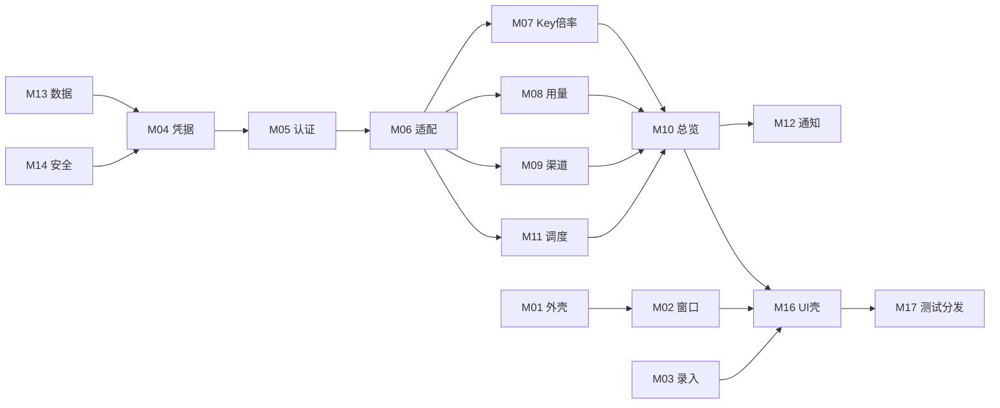

# liran_docs 中心索引

## 1.7.12 当前增量

- GeeTest Electron 官方窗口不再做 User-Agent、UA-CH 或 CDP iframe 目标注入，使用原生 Electron 浏览器标识；Cloudflare Turnstile 继续由系统 Google Chrome 独立临时 Profile 承接。
- 真实 Chrome 只读取同源有限 Token 白名单；临时 session、同源导航、Escape、网络重试、核心校验和失败不落盘边界保持不变。
- 本轮验证证据见 [[04-开发追踪]]、[[08-测试用例]]、[[09-真机实测]] 和 `real-test-evidence/macos-1.7.12-final/`。

## 1.7.10 当前增量

- Chrome 登录失败、窗口关闭、Token 缺失、来源拦截和未安装 Chrome 时保留安全验证弹窗，支持直接重试且不保存半成品。
- 当前版本与证据见 [[04-开发追踪]]、[[08-测试用例]]、[[09-真机实测]]、`real-test-evidence/macos-1.7.10-current/` 和 `docs/pitfalls/sub2api-adapter.md`。

## 1.7.9 当前增量

- Turnstile 认证改由真实系统 Google Chrome 独立临时 Profile 承接；主进程只读取同源有限 Token 白名单，支持 macOS/Windows 路径发现、CDP 失败、超时、关闭和清理。
- 重新验证增加 profile 账号归属校验；站点管理弹窗和统一通知完成窄窗口布局复核，渠道状态失败继续使用 stale-while-revalidate。
- 证据与边界见 [[04-开发追踪]]、[[08-测试用例]]、[[09-真机实测]]、`real-test-evidence/macos-1.7.9/` 和 `docs/pitfalls/sub2api-adapter.md`。

## 1.7.3 当前增量

- 交互认证收口：access-only Token、同源重定向拦截、重新验证失败原子回滚和站点级缓存/运行态清理。
- 版本与验收：[[01-需求文档]]、[[02-架构文档]]、[[04-开发追踪]]、[[08-测试用例]]、[[09-真机实测]] 和 `docs/pitfalls/sub2api-adapter.md`。
- 当前状态覆盖历史模块表中的旧“待开发”描述：站点管理、认证、适配器、通知、IPC 与渠道 stale 逻辑已实现并通过自动化；最新 macOS 打包页面复核通过，真实 Turnstile 挑战仍受外部网络阻塞，Windows 仍仅为交叉构建证据。

## 1.7.2 当前增量

- 交互登录错误分类覆盖 2xx 错误包；渠道强刷失败保留最近成功数据和手动选择；站点保存失败执行回滚。
- 细节见 [[01-需求文档]]、[[02-架构文档]]、[[07-API文档]]、[[08-测试用例]]、[[09-真机实测]] 与 `docs/pitfalls/sub2api-adapter.md`。

## 1.7.1 当前增量

- 历史版本曾移除 Electron User-Agent 标记；该逻辑已由 1.7.12 撤销，当前 GeeTest 窗口使用原生标识，Turnstile 使用系统 Chrome。
- 真实 Turnstile challenge 的网络失败必须按外部阻塞记录；当前客户端已修复一类 RFC 2544 假 IP/TLS 问题，但真实 CAPTCHA 仍需用户本人完成；见 [[09-真机实测]] 与 `docs/pitfalls/sub2api-adapter.md`。

## 1.7.0 当前增量

- 需求主线：[[01-需求文档]] 的 RQ-29/RQ-30/RQ-31，覆盖 GeeTest、Cloudflare Turnstile、重复站点身份、统一应用内通知和渠道 stale-while-revalidate。
- 架构与安全：[[02-架构文档]]、[[modules/05-认证与Token生命周期]]、[[modules/06-API适配器与能力探测]]、[[modules/14-IPC安全与日志]]。
- 站点与凭据：[[modules/03-站点管理与首次引导]]、[[modules/04-常用账号与安全凭据]]。
- UI 与通知：[[10-UI壳接入清单]]、[[ui-shells/站点录入管理与设置-UI壳接入清单]]、[[ui-shells/渠道状态-UI壳接入清单]]、[[modules/12-通知]]。
- 验收与追踪：[[04-开发追踪]]、[[08-测试用例]]、[[09-真机实测]]；Windows 仅记录交叉构建证据。

## 1.4.5 本轮变更

- API 密钥分组菜单按内容自适应宽度，避免长分组名称截断。
- 主界面右上角保留“最后更新：时间”并新增独立版本徽标 `v1.4.5`。

## 1.5.2 本轮变更

- 删除渠道状态页面顶部独立的 Key 分组关联面板。
- 在全部站点的“查看渠道状态”弹层中，为每个渠道卡片提供独立关联、取消关联和保存反馈。
- 关联仍按 `siteId + groupId` 持久化，支持多渠道并保持自动匹配与总览摘要同步。

## 1.4.4 本轮变更

- 总览倍率推荐：无渠道状态分组参与候选但标记待核验；支持状态下歧义、异常和过期数据不参与。
- 总览额度与卡片：当前 Key 额度口径保持有限额优先，充值比例操作区改为窄卡片稳定布局。
- API 密钥与站点选择：行内分组使用自定义菜单分栏显示名称、平台和倍率，API 密钥、使用记录、渠道状态站点选择器优先显示备注。

## 1.4.3 本轮变更

- API 密钥页面：完整 Key 临时展示/复制、分组倍率预览、平台/倍率图标、消费列合并和过期列删除。
- 悬浮窗：今日 Token/消费改用当前有效 API Key 统计。
- 状态：代码与内部测试已完成，真实站点、安装副本和发布产物待验收。

上级：[[00-项目说明书]]
下级：全部规划文档与模块
依赖：[[01-需求文档]]、[[02-架构文档]]

本文件是文档结构、模块依赖和需求追踪的单一事实来源。后续增加、移动或重命名文档时必须先更新本索引。`1.4.0` 已完成 API 密钥与监控联动；`1.4.1` 修复 macOS bundle 签名；`1.4.2` 已统一总览额度并为总览增加结构候选内唯一择优，完成安装副本 E2E、页面检查和双平台产物审计。Windows 真机、Apple Developer ID 签名、公证、CI 和 Gitee Release 分发仍未完成。

## 2026-07-24 API 密钥与监控联动收口

本轮按用户确认取消独立 UI 壳阶段，并在唯一 `/goal` 中完成 UI 与真实业务接线。代码、测试、真实站点、macOS 页面和双平台产物均已有证据；第三站因 Turnstile 仅完成现有浏览器会话只读确认，不计为 Electron 写入通过。

| 业务链                     | 主模块 | 受影响模块              | 规划任务     | 当前状态               |
| -------------------------- | ------ | ----------------------- | ------------ | ---------------------- |
| API 密钥管理与分组切换     | M07    | M01、M06、M08、M14、M16 | AK-01..AK-12 | 已完成                 |
| 使用记录自动筛选与汇总     | M08    | M06、M14、M16           | UF-01..UF-08 | 已完成                 |
| 全部站点按当前 Key 汇总    | M10    | M07、M08、M09、M11      | OK-01..OK-08 | 已完成                 |
| 渠道状态低频实时监控       | M11    | M01、M06、M09、M10      | CR-01..CR-09 | 已完成                 |
| Key-渠道关联与状态语义修复 | M09    | M06、M07、M10、M16      | CM-01..CM-10 | 已完成                 |
| 跨模块回归、版本与发布     | M17    | 全模块                  | RV-01..RV-08 | 已完成；Windows 非真机 |

上游能力缺口固定记录为：没有跨站统一汇总接口、没有 API Key 直接关联 monitor ID 的接口、没有普通用户主动触发渠道探测接口。实现不得伪造这些能力。

## 核心文档

| 文档                                                                          | 用途                                                         |
| ----------------------------------------------------------------------------- | ------------------------------------------------------------ |
| [用户原话.md](用户原话.md)                                                    | 首次原话、确认结果和来源边界                                 |
| [00-项目说明书.md](00-项目说明书.md)                                          | 项目目标、用户、范围和完成定义                               |
| [01-需求文档.md](01-需求文档.md)                                              | RQ-01 至 RQ-28 产品需求与规则                                |
| [02-架构文档.md](02-架构文档.md)                                              | 进程、模块、数据流、认证流和安全边界                         |
| [04-开发追踪.md](04-开发追踪.md)                                              | 历史阶段、当前 69 项微观任务和实施门禁                       |
| [05-术语表.md](05-术语表.md)                                                  | 统一术语与状态定义                                           |
| [06-数据字典.md](06-数据字典.md)                                              | 逻辑实体、敏感级别、存储与生命周期                           |
| [07-API文档.md](07-API文档.md)                                                | 上游源码接口证据与真实站待验证项                             |
| [08-测试用例.md](08-测试用例.md)                                              | 自动化、macOS、Windows CI 和视觉用例                         |
| [09-真机实测.md](09-真机实测.md)                                              | 历史证据与 RQ-22..28 的 Codex macOS 待测清单                 |
| [在线更新与真机更新验证](modules/17-测试构建与分发/在线更新与真机更新验证.md) | UPD-28 平台策略、GitHub 资产、Gitee 镜像、测试批次和验收边界 |
| [10-UI壳接入清单.md](10-UI壳接入清单.md)                                      | UI 壳总范围、历史 Stitch 与当前 Codex 路线门禁               |
| [ui-shells/_README.md](ui-shells/_README.md)                                  | 历史壳、Radar 与 API 密钥 Codex 壳清单                       |
| [Stitch 产物登记](stitch-artifacts/README.md)                                 | Project、5 个业务 Screen、Design System 和下载来源           |
| [主框架与全站总览清单](ui-shells/应用主框架与全站总览-UI壳接入清单.md)        | 全部站点 Screen 与施工白名单                                 |
| [使用记录清单](ui-shells/使用记录-UI壳接入清单.md)                            | 使用记录 Screen 与施工白名单                                 |
| [渠道状态清单](ui-shells/渠道状态-UI壳接入清单.md)                            | 渠道状态 Screen 与施工白名单                                 |
| [API 密钥清单](ui-shells/API密钥-UI壳接入清单.md)                             | API 密钥页面结构、状态、事件与施工白名单                     |
| [站点与设置清单](ui-shells/站点录入管理与设置-UI壳接入清单.md)                | 站点管理与设置 Screen 及施工白名单                           |
| [悬浮窗清单](ui-shells/悬浮窗-UI壳接入清单.md)                                | 悬浮窗 Screen 与独立 Renderer 规格                           |
| [Radar 清单](ui-shells/Codex-Radar-UI壳接入清单.md)                           | Radar 正式导航、公开数据和局部状态                           |

## 真实 UI 壳施工入口

| 入口            | 文件                                            | 状态                                           |
| --------------- | ----------------------------------------------- | ---------------------------------------------- |
| Renderer 根入口 | `src/renderer/main.tsx`、`src/renderer/App.tsx` | 正式导航与业务 ViewModel 已接线                |
| 受控预览与状态  | `src/renderer/preview/`                         | 仅开发预览；生产不显示                         |
| 总览壳          | `src/renderer/shells/overview/`                 | 接线内部测试及 macOS 适用项通过                |
| 使用记录壳      | `src/renderer/shells/usage/`                    | 接线内部测试及 macOS 适用项通过                |
| 渠道状态壳      | `src/renderer/shells/channels/`                 | 接线通过；真实扩展指标待站点提供               |
| API 密钥壳      | `src/renderer/shells/api-keys/`                 | 正式页面已接线；1.4.4 自定义菜单待安装副本复核 |
| 站点与设置壳    | `src/renderer/shells/sites/`                    | 接线及 macOS 隔离删站通过                      |
| 悬浮窗壳        | `src/renderer/shells/floating/`                 | 接线内部测试及 macOS 适用项通过                |

## 模块树

| 模块                      | 文档                                                               | 需求                            | 直接依赖             | 状态                                                         |
| ------------------------- | ------------------------------------------------------------------ | ------------------------------- | -------------------- | ------------------------------------------------------------ |
| M01 应用外壳与生命周期    | [模块文档](modules/01-应用外壳与生命周期/_应用外壳与生命周期.md)   | RQ-12,RQ-18,RQ-19               | M13,M14              | 真机测试通过（适用项）                                       |
| M02 窗口悬浮窗与托盘      | [模块文档](modules/02-窗口悬浮窗与托盘/_窗口悬浮窗与托盘.md)       | RQ-03,RQ-11,RQ-12               | M01,M11              | 真机测试通过（适用项）                                       |
| M03 站点管理与首次引导    | [模块文档](modules/03-站点管理与首次引导/_站点管理与首次引导.md)   | RQ-01,RQ-16                     | M04,M05,M06          | 真机测试通过                                                 |
| M04 站点安全凭据          | [模块文档](modules/04-常用账号与安全凭据/_常用账号与安全凭据.md)   | RQ-14,RQ-15                     | M13,M14              | 真机测试通过（macOS）                                        |
| M05 认证与 Token 生命周期 | [模块文档](modules/05-认证与Token生命周期/_认证与Token生命周期.md) | RQ-01,RQ-14,RQ-16               | M04,M06              | 真机测试通过（macOS）                                        |
| M06 API 适配器与能力探测  | [模块文档](modules/06-API适配器与能力探测/_API适配器与能力探测.md) | RQ-01,RQ-05..08,RQ-16,RQ-22..26 | M05                  | 历史只读真机通过；RQ-22..26 待开发                           |
| M07 API Key 与倍率        | [模块文档](modules/07-API-Key与倍率/_API-Key与倍率.md)             | RQ-04,RQ-05,RQ-22,RQ-27         | M06,M08              | 历史 `1.3.4` 通过；本轮待 UI 路线                            |
| M08 今日统计与使用记录    | [模块文档](modules/08-今日统计与使用记录/_今日统计与使用记录.md)   | RQ-06,RQ-07,RQ-23,RQ-27         | M06,M07              | 历史真机通过；本轮待 UI 路线                                 |
| M09 渠道状态              | [模块文档](modules/09-渠道状态/_渠道状态.md)                       | RQ-08,RQ-16,RQ-26,RQ-27         | M06,M11              | 历史 `1.3.4` 通过；本轮待 UI 路线                            |
| M10 全站总览与汇总        | [模块文档](modules/10-全站总览与汇总/_全站总览与汇总.md)           | RQ-09,RQ-11,RQ-24,RQ-27         | M07,M08,M09,M11      | 历史 `1.3.4` 通过；本轮待 UI 路线                            |
| M11 调度缓存与退避        | [模块文档](modules/11-调度缓存与退避/_调度缓存与退避.md)           | RQ-10,RQ-11,RQ-25,RQ-27         | M06,M13              | 历史适用项通过；本轮待 UI 路线                               |
| M12 通知                  | [模块文档](modules/12-通知/_通知.md)                               | RQ-13                           | M10,M13              | 真机测试通过（受控态）                                       |
| M13 本地数据生命周期      | [模块文档](modules/13-本地数据生命周期/_本地数据生命周期.md)       | RQ-14                           | 数据字典             | 真机测试通过（macOS）                                        |
| M14 IPC 安全与日志        | [模块文档](modules/14-IPC安全与日志/_IPC安全与日志.md)             | RQ-15,RQ-18,RQ-27               | 架构、数据字典       | 历史真机通过；RQ-27 待开发                                   |
| M15 设置导出与删除        | [模块文档](modules/15-设置导出与删除/_设置导出与删除.md)           | RQ-10,RQ-13,RQ-14,RQ-19         | M04,M13              | 真机测试通过（已实现项）                                     |
| M16 UI 壳与 Stitch        | [模块文档](modules/16-UI壳与Stitch/_UI壳与Stitch.md)               | RQ-17,RQ-27                     | 全业务模块、UI总清单 | 历史适用项通过；本轮待 UI 路线                               |
| M17 测试构建与分发        | [模块文档](modules/17-测试构建与分发/_测试构建与分发.md)           | RQ-18,RQ-19,RQ-27,RQ-28         | 全模块               | 1.4.6 Gitee 双平台 Release；macOS 已验收，Windows 真机待验证 |

## 横向依赖总表

M05 与 M06 的表面双向关系通过接口倒置解除：M06 提供低层无认证 HTTP 运输和端点描述，M05 管理 Token，再由认证装饰器组合成完整客户端。实现时禁止形成模块循环导入。

## 2026-07-18 外发版功能合并映射

本节是朋友版功能回并到当前主线的记录入口。此前 1.0.0 的真机和打包证据继续保留为历史证据；下表中的 1.1.0 能力已完成实现、验收和产物审计。

| 功能增量                             | 主线模块           | 主要代码范围                                                                   | 规划任务                     | 当前状态     |
| ------------------------------------ | ------------------ | ------------------------------------------------------------------------------ | ---------------------------- | ------------ |
| Codex Radar 固定导航与 Electron 嵌入 | M10、M16、M17      | `src/renderer/App.tsx`、`src/renderer/shells/radar/`、`electron/main/index.ts` | MERGE-03、MERGE-09           | 1.8.1 已完成 |
| 使用记录推理/缓存/耗时               | M06、M08、M14      | `electron/main/adapters/`、`electron/shared/`、usage 壳、CSV                   | MERGE-02、MERGE-04           | 1.1.0 已完成 |
| 渠道关系、排序与请求协调             | M06、M09、M10、M11 | channels 适配器、`channel-ranking`、请求协调和 App 状态                        | MERGE-02、MERGE-05、MERGE-06 | 1.1.0 已完成 |
| 悬浮窗透明度                         | M02、M13、M16      | 主进程窗口、设置 IPC、floating 壳和样式                                        | MERGE-07                     | 1.1.0 已完成 |
| macOS/Windows 功能与产物同步         | M01、M02、M14、M17 | Electron 平台分支、构建配置、E2E 和发布脚本                                    | MERGE-01、MERGE-08、MERGE-10 | 1.1.0 已完成 |

本次合并禁止整文件覆盖；朋友版与主线冲突时以主线非激活悬浮窗、安全 preload、敏感数据边界和 ARM64 发布规则为准。

## 需求追踪矩阵

| 需求  | 模块                                    | 任务                                                   | 测试                              |
| ----- | --------------------------------------- | ------------------------------------------------------ | --------------------------------- |
| RQ-01 | M03,M05,M06                             | TASK-03-04..06,TASK-04-01..04,TASK-07-02/03,TASK-10-01 | TC-01A..F                         |
| RQ-03 | M02                                     | TASK-06-01..03,TASK-10-03,TASK-13-02                   | TC-03A..F                         |
| RQ-04 | M07                                     | TASK-05-01..03,TASK-10-02                              | TC-04A..G                         |
| RQ-05 | M06,M07                                 | TASK-04-04,TASK-05-04,TASK-10-02                       | TC-05A..D                         |
| RQ-06 | M08                                     | TASK-04-05,TASK-05-05,TASK-10-03                       | TC-06A..E                         |
| RQ-07 | M08                                     | TASK-07-05,TASK-10-04/05,TASK-12-03                    | TC-07A..G                         |
| RQ-08 | M09                                     | TASK-04-06,TASK-07-06,TASK-10-06,TASK-12-04            | TC-08A..F                         |
| RQ-09 | M10                                     | TASK-05-06,TASK-07-07,TASK-10-07                       | TC-09A..E                         |
| RQ-10 | M11,M15                                 | TASK-05-07..10,TASK-11-04/05,TASK-12-05                | TC-10A..H                         |
| RQ-11 | M02,M10,M11                             | TASK-05-10,TASK-06-03,TASK-10-07                       | TC-11A..G                         |
| RQ-12 | M01,M02                                 | TASK-01-02,TASK-06-04/05,TASK-13-02/04                 | TC-12A..F                         |
| RQ-13 | M12,M15                                 | TASK-11-01..05,TASK-13-04                              | TC-13A..G                         |
| RQ-14 | M04,M13,M15                             | TASK-02-02..04,TASK-03-01..03,TASK-11-06,TASK-12-06    | TC-14A..H                         |
| RQ-15 | M04,M14                                 | TASK-01-03/04,TASK-12-07..09                           | TC-15A..H                         |
| RQ-16 | M03,M05,M06,M09                         | TASK-04-01..06,TASK-10-01/06                           | TC-16A..F                         |
| RQ-17 | M16                                     | TASK-08-01..04,TASK-09-01..06,TASK-12-11               | TC-17A..T                         |
| RQ-18 | M01,M14,M17                             | TASK-12-01..11,TASK-13-01..05,TASK-14-01/03            | TC-18A..G                         |
| RQ-19 | M01,M15,M17                             | TASK-14-02/04,TASK-15-01..04                           | TC-19A..F                         |
| RQ-20 | M10,M16,M17                             | MERGE-03,MERGE-09                                      | TC-MERGE-01/02/08                 |
| RQ-21 | M01,M02,M14,M17                         | MERGE-01,MERGE-07,MERGE-08,MERGE-10                    | TC-MERGE-06/07/09/10              |
| RQ-22 | M01,M06,M07,M08,M14,M16                 | AK-01..AK-12                                           | TC-AK-01..07                      |
| RQ-23 | M06,M08,M14,M16                         | UF-01..UF-08                                           | TC-UF-01..05                      |
| RQ-24 | M06,M07,M08,M09,M10,M11                 | OK-01..OK-08                                           | TC-OK-01..04                      |
| RQ-25 | M01,M06,M09,M10,M11,M14                 | CR-01..CR-09                                           | TC-CR-01..05                      |
| RQ-26 | M06,M07,M09,M10,M16                     | CM-01..CM-10                                           | TC-CM-01..05                      |
| RQ-27 | M01,M06,M07,M08,M09,M10,M11,M14,M16,M17 | RV-01..RV-08                                           | TC-RV-01..04                      |
| RQ-28 | M01,M14,M16,M17                         | UPD-28-01..14                                          | TC-UPD-01..10；09-真机实测 UPD-28 |

## 外部输入状态

- 两个真实中转站地址已用于本轮只读真机验证；普通用户凭据只在运行时和平台安全存储中使用，不进入文档/Git。
- Stitch Project ID、5 个业务 Screen、Design System、HTML 与截图：已提供并登记；控件规格盘点、真实 UI 壳承接和实例级复修已有文件与测试证据。本 Stitch 路线不执行 Design QA。
- 已取消常用账号需求；`src/renderer/shells/sites/` 中模板按钮、静态字段、类型字段和专属样式已清除，并由结构回归测试、lint、typecheck、Vitest、构建与 Electron E2E 验证。五个 UI 壳已接真实业务，正式运行态不显示预览控制器或静态回退。
- Windows 真实设备：不在当前验收范围；只做 CI。
